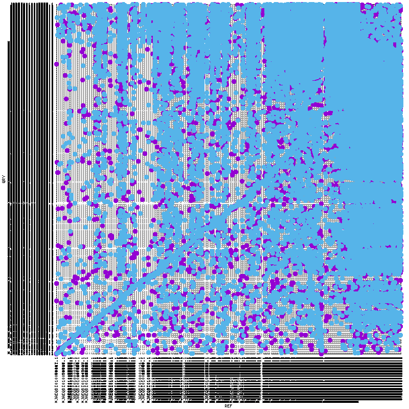
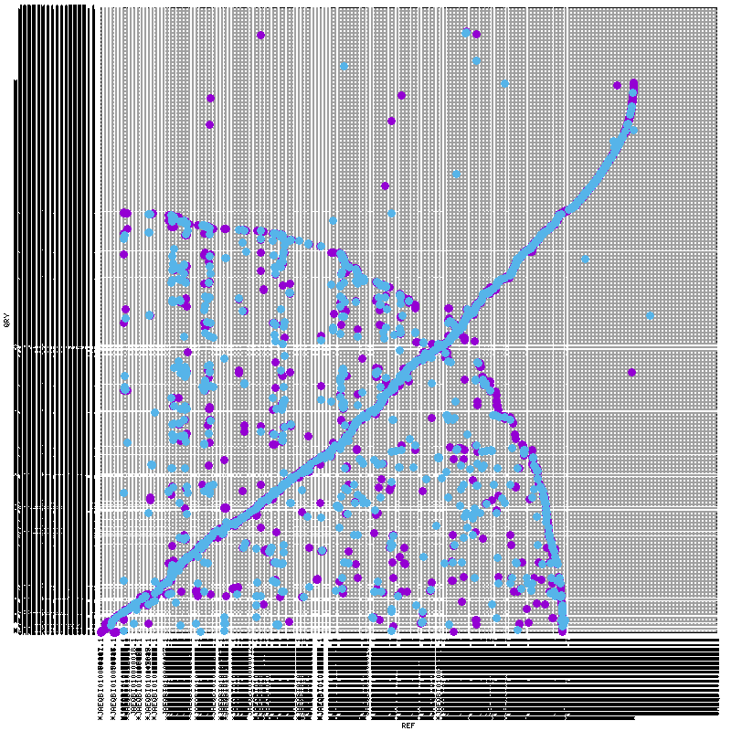

# Phase 0 — Published Cai and Guo Baseline

**Status: Complete**

## Objective

Establish a reproducible baseline for the two published *Sapria himalayana* genome assemblies before any reassembly is introduced.

The phase compares:

- the published **Cai assembly**, representing the Thailand accession;
- the published **Guo assembly**, representing the China accession.

The purpose is not to treat either assembly as a perfect reference. Instead, Phase 0 documents their reported construction, basic structural properties, conserved gene-space recovery, and whole-assembly correspondence under consistent analysis settings.

## Scope completed

- comparison of the assembly approaches reported in the original studies;
- assembly-statistic extraction through BUSCO reports;
- BUSCO 5.8.0 benchmarking with AUGUSTUS and Miniprot;
- broad Galaxy NUCmer visualization;
- strict local NUCmer analysis on Gargantua;
- many-to-many and one-to-one MUMmerplots;
- DNAdiff quantitative comparison;
- interpretation of filtering, fragmentation, repeats, and layout effects.

## Input assemblies

| Assembly | Label used here | Geographic shorthand | Role |
|---|---|---|---|
| Published Cai assembly | Cai published | TH | NUCmer reference |
| Published Guo assembly | Guo published | CN | NUCmer query |

`TH` and `CN` identify the sampled accessions and must not be interpreted as population-level representation.

## Published assembly statistics

| Metric | Cai published | Guo published |
|---|---:|---:|
| Total span | 1,276,270,856 bp | 2,060,974,854 bp |
| Scaffolds | 128,027 | 18,718 |
| Contigs | 216,625 | 26,955 |
| Gap content | 7.319% | 1.865% |
| Scaffold N50 | 952 kb | 251 kb |
| Contig N50 | 19 kb | 106 kb |

### Structural interpretation

The Cai scaffold N50 is larger than the Guo scaffold N50, but Cai has a much smaller contig N50 and substantially more gap sequence. This demonstrates why scaffold N50 alone can be misleading: scaffold joins can inflate apparent continuity while the underlying gap-free sequence remains fragmented.

Guo is much larger and less fragmented at the contig level, but neither assembly is chromosome-scale.

## BUSCO comparison

BUSCO version: **5.8.0**  
Lineage: **embryophyta_odb10**  
BUSCO groups: **1,614**

### Summary

| Assembly | Predictor | Complete | Single-copy | Duplicated | Fragmented | Missing | Complete with internal stops |
|---|---|---:|---:|---:|---:|---:|---:|
| Cai published | AUGUSTUS | 47.5% | 46.7% | 0.9% | 3.3% | 49.1% | not reported |
| Cai published | Miniprot | 49.3% | 48.1% | 1.1% | 5.4% | 45.4% | 47 |
| Guo published | AUGUSTUS | 49.7% | 48.0% | 1.7% | 2.5% | 47.8% | not reported |
| Guo published | Miniprot | 51.2% | 48.7% | 2.5% | 4.5% | 44.2% | 43 |

### Interpretation

The two assemblies recover broadly similar conserved plant gene space despite their large difference in assembly span. Guo scores modestly higher under both predictors, but neither assembly approaches the BUSCO completeness expected for a high-quality model-plant reference.

The close agreement between AUGUSTUS and Miniprot in both published assemblies contrasts with the much larger predictor gap later observed in the unpolished Cai Flye draft. This makes the published assemblies useful empirical controls for evaluating base-level polishing.

Miniprot reports internal stop codons in 47 Cai BUSCOs and 43 Guo BUSCOs. These values establish a practical baseline for later polishing comparisons.

### Archived BUSCO files

- [`Cai published — AUGUSTUS`](busco/Cai_published_BUSCO5.8_embryophyta_odb10_AUGUSTUS.txt)
- [`Cai published — Miniprot`](busco/Cai_published_BUSCO5.8_embryophyta_odb10_Miniprot.txt)
- [`Guo published — AUGUSTUS`](busco/Guo_published_BUSCO5.8_embryophyta_odb10_AUGUSTUS.txt)
- [`Guo published — Miniprot`](busco/Guo_published_BUSCO5.8_embryophyta_odb10_Miniprot.txt)

## Whole-assembly comparison

### NUCmer baseline

The reproducible Gargantua run used:

```bash
nucmer --mum -l 100 -c 500 -t 1 \
  -p CaiPublishedRef_GuoPublishedQuery_strict \
  Cai_published.fasta \
  Guo_published.fasta
```

Cai was used as the reference because the Guo-reference orientation exceeded the local WSL memory ceiling.

Complete commands are archived in [`commands/MUMmer4_commands.md`](commands/MUMmer4_commands.md).

## Figure 1 — Broad Galaxy NUCmer plot


**Interpretation:** The broad Galaxy view is saturated by extensive repetitive, duplicated, reverse-oriented, and multiply matching sequence relationships. The very different scaffold counts—128,027 for Cai and 18,718 for Guo—plus arbitrary contig order make the plot unsuitable for direct structural interpretation.

The plot is retained because it provides an important methodological lesson: a whole-genome dot plot can become visually chaotic when weakly filtered relationships from fragmented and repeat-rich assemblies are displayed together.

## Figure 2 — Strict many-to-many MUMmerplot



This plot was generated from the strict NUCmer run followed by `delta-filter -m`.

**Interpretation:** Many-to-many filtering retains repeated and duplicated relationships while discarding weaker alignments. The plot remains dense, but a positive-slope backbone and coherent alignment structures become visible.

This view is useful for visualizing alignment multiplicity and assembly complexity. It is not a direct estimate of repeat percentage because individual alignment blocks may overlap.

## Figure 3 — Strict one-to-one MUMmerplot



This plot was generated using `delta-filter -1`.

**Interpretation:** One-to-one filtering removes most ambiguous repetitive matches and exposes the strongest shared assembly backbone. A prominent positive-slope chain is visible, together with a large reverse-oriented chain and residual scattered blocks.

The reverse-oriented structure is a candidate assembly-level discordance. It is not, by itself, proof of a biological inversion. The inputs are highly fragmented, and `mummerplot --layout` reorders contigs according to alignment relationships rather than native chromosome position.

## DNAdiff results

The full report is archived at:

[`mummer_dnadiff/CaiPublishedRef_GuoPublishedQuery_dnadiff.report`](mummer_dnadiff/CaiPublishedRef_GuoPublishedQuery_dnadiff.report)

### Sequence and base coverage

| Metric | Cai reference | Guo query |
|---|---:|---:|
| Total sequences | 128,027 | 18,718 |
| Aligned sequences | 79,720 (62.27%) | 16,950 (90.55%) |
| Unaligned sequences | 48,307 (37.73%) | 1,768 (9.45%) |
| Total bases | 1,276,270,856 | 2,060,974,854 |
| Aligned bases | 991,525,524 (77.69%) | 1,365,929,127 (66.28%) |
| Unaligned bases | 284,745,332 (22.31%) | 695,045,727 (33.72%) |

The different sequence-level and base-level percentages reflect the strongly different fragmentation profiles. Guo has far fewer sequences, yet a larger fraction of its total bases remains outside aligned regions.

### Alignment classes

| Metric | One-to-one | Many-to-many |
|---|---:|---:|
| Alignment blocks | 113,462 | 242,004 |
| Cai cumulative aligned length | 954,255,421 bp | 1,503,164,497 bp |
| Guo cumulative aligned length | 954,247,190 bp | 1,502,394,981 bp |
| Mean block length | ~8.41 kb | ~6.21 kb |
| Mean identity | 99.1547% | 98.7062% |

The approximately 954 Mb one-to-one correspondence at 99.15% identity demonstrates a substantial shared sequence backbone. The much larger many-to-many cumulative length reflects repeated, duplicated, collapsed, or otherwise ambiguous relationships. Because alignments can overlap, cumulative many-to-many length must not be treated as unique genome coverage.

### Assembly-level discordance estimates

| Feature estimate | Cai reference | Guo query |
|---|---:|---:|
| Breakpoints | 263,125 | 474,728 |
| Relocations | 1,156 | 831 |
| Translocations / sequence switches | 11,917 | 67,583 |
| Inversions | 1,830 | 739 |

These are DNAdiff alignment-discordance estimates, not validated biological event counts. Fragmentation, repeat ambiguity, scaffold ordering, gap structure, collapsed repeats, and haplotypic redundancy can inflate all four categories.

### Alignment-derived nucleotide differences

DNAdiff reported:

- 2,799,491 SNP-like substitutions;
- 3,937,414 indel-like differences.

These values describe differences between two independently generated assemblies. They must not be presented as population SNP or indel calls. They may combine true accession variation with sequencing errors, polishing differences, gap-associated differences, alignment ambiguity, and assembly artifacts.

## Main Phase 0 conclusions

1. The published Cai and Guo assemblies contain a strong shared sequence backbone.
2. Guo is substantially larger and more contiguous at the contig level.
3. The two published assemblies recover similar conserved plant gene space.
4. Cai's scaffold N50 is inflated relative to its low contig N50 and high gap content.
5. Raw or broadly filtered MUMmerplots are dominated by repeats and fragmentation.
6. Strict one-to-one filtering reveals interpretable shared structure but does not reconstruct chromosomes.
7. DNAdiff structural categories cannot be equated directly with biological rearrangements.
8. The published assemblies provide the baseline against which the harmonized reassemblies will be judged.

## Completion criteria

- [x] Published assembly statistics archived
- [x] BUSCO AUGUSTUS comparison completed
- [x] BUSCO Miniprot comparison completed
- [x] Broad Galaxy plot archived
- [x] Strict many-to-many plot archived
- [x] Strict one-to-one plot archived
- [x] DNAdiff report archived and interpreted
- [x] Commands documented
- [x] Phase-level conclusions recorded

## Next phase

Proceed to Phase 1: Cai long-read reassembly, short-read polishing, and comparison against this published baseline.
