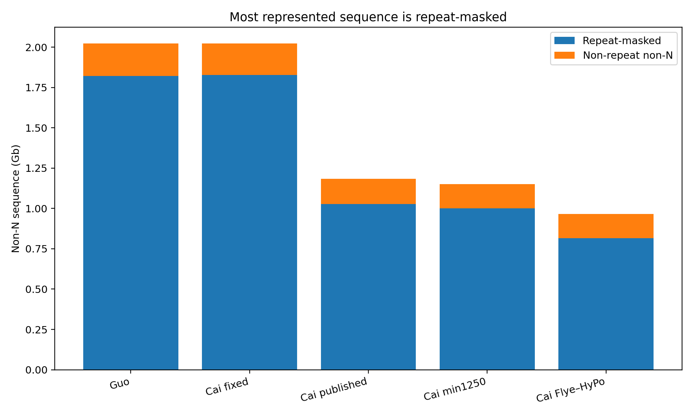
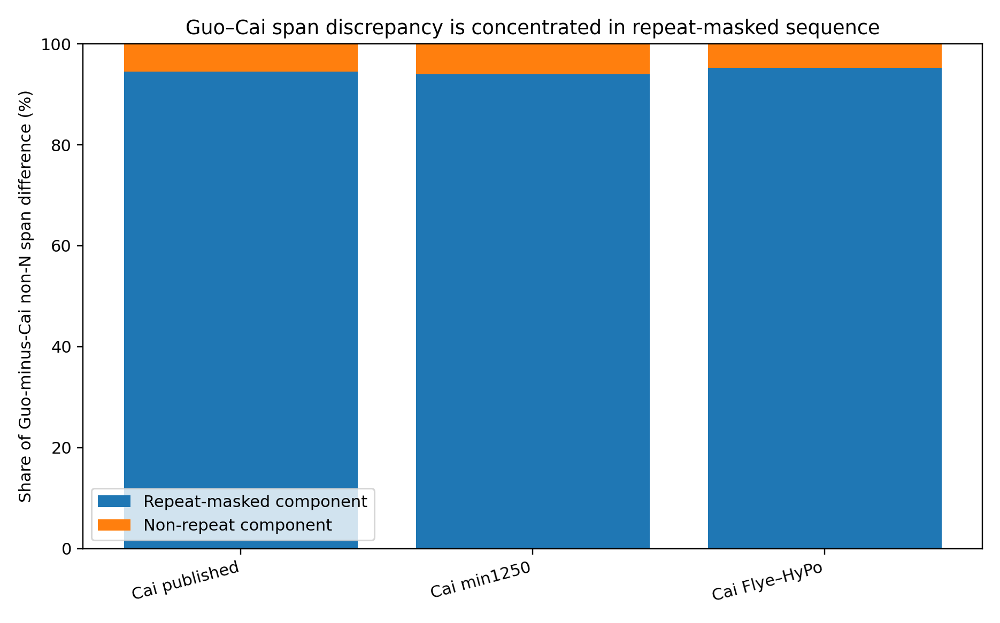
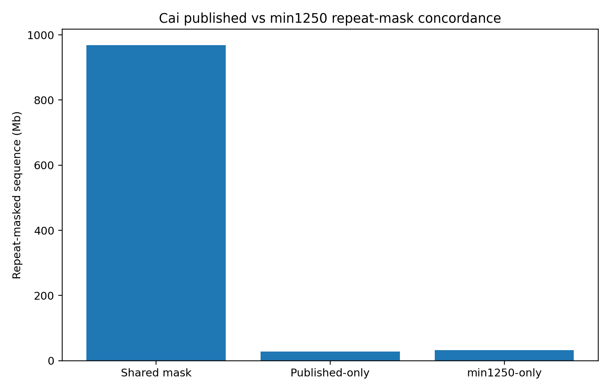
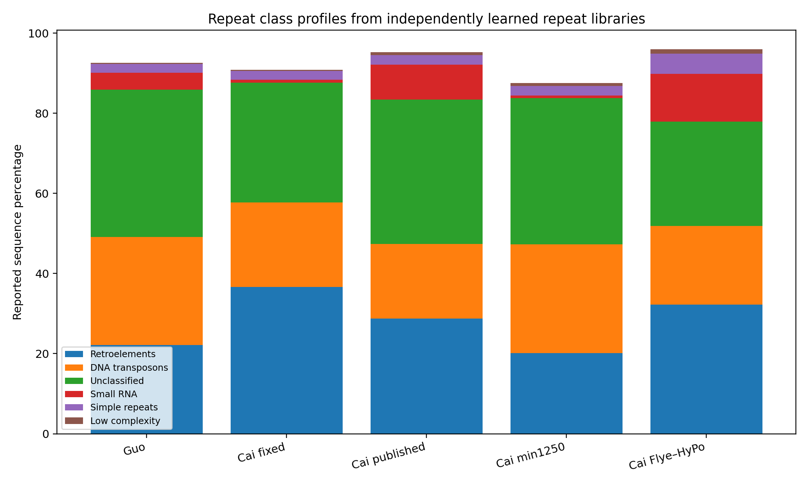

# Phase 4 — Repeat Discovery and Annotation

**Status: Core analysis complete**

## Objective

Phase 4 quantifies repeat burden across the principal *Sapria himalayana* genome representations and supplies the repeat coordinates needed to test whether assembly disagreement, giant introns, and annotation instability are concentrated in repetitive sequence.

RepeatModeler was run independently for each genome representation, and each corresponding custom library was used with RepeatMasker 4.1.5 (`rmblastn` 2.14.1+).

That design reflects the analysis actually performed. It also creates an important interpretation constraint:

> **Total repeat burden and coordinate-level repeat overlap are directly useful, but repeat-class differences across independently learned libraries must not automatically be interpreted as biological expansion or contraction of particular repeat families.**

Raw Phase 4 GFF3 files are archived on Zenodo: https://doi.org/10.5281/zenodo.23105473

---

## 1. Repeat burden across genome representations

| Representation | Non-N sequence | Repeat-masked bp | Repeat-masked non-N | Non-repeat non-N |
|---|---:|---:|---:|---:|
| **Guo published** | 2.023 Gb | **1.821 Gb** | **90.02%** | 201.9 Mb |
| **Cai fixed-on-Guo** | 2.023 Gb | **1.827 Gb** | **90.35%** | 195.2 Mb |
| **Cai published** | 1.183 Gb | **1.027 Gb** | **86.81%** | 156.0 Mb |
| **Cai min1250** | 1.152 Gb | **1.002 Gb** | **87.00%** | 149.7 Mb |
| **Cai Flye–HyPo** | 0.966 Gb | **0.815 Gb** | **84.32%** | 151.5 Mb |

All five representations are therefore extremely repeat-rich. RepeatMasker masks **84.32–90.35% of non-N sequence**.

The three Cai structural representations are especially informative: despite non-N spans ranging from ~0.966 to ~1.183 Gb, their non-repeat non-N sequence converges near **150–156 Mb**.

This suggests that much of the representation-level expansion and contraction among Cai assemblies occurs in repeat-rich sequence rather than in the non-repeat component.

---

## 2. Most Guo–Cai span disagreement lies in repeat-masked sequence

Using the RepeatMasker calls to decompose **non-N representation span**:

- Guo minus published Cai: **839.5 Mb** additional non-N sequence, of which **793.7 Mb (94.54%)** is repeat-masked.
- Guo minus Cai min1250: **871.0 Mb**, of which **818.9 Mb (94.01%)** is repeat-masked.
- Guo minus Cai Flye–HyPo: **1.056 Gb**, of which **1.006 Gb (95.23%)** is repeat-masked.

Within Cai itself, published Cai contains **216.5 Mb** more non-N sequence than Cai Flye–HyPo, and **212.0 Mb (97.91%)** of that difference is repeat-masked.

This is a **representation-level decomposition**, not proof that all additional repetitive sequence is true biological gain or loss. Assembly reconstruction and the independently learned repeat libraries can both contribute.

Nevertheless, the result places repeat-rich sequence at the center of the assembly-span paradox.

---

## 3. The Cai min1250 technical filter preserves repeat-space almost completely

Cai min1250 is a strict scaffold-length derivative of published Cai, making it a particularly valuable internal control.

On the retained scaffold context:

- shared repeat-masked sequence: **968.90 Mb**
- mask unique to published-Cai run: **27.78 Mb**
- mask unique to min1250 run: **32.91 Mb**
- base-level mask Jaccard: **0.941**
- **97.21%** of the published-Cai retained mask is shared with min1250
- **96.72%** of the min1250 mask is shared with published Cai

Thus the 1,250-bp technical rescue preserves the overwhelming majority of repeat-space while reducing the FASTA record count below the annotation-tool constraint.

---

## 4. Repeat-class profiles are method-sensitive

The de novo class summaries vary far more than total repeat burden.

For example, between published Cai and Cai min1250—assemblies sharing nearly all retained sequence—the reported profiles change by approximately:

- retroelements: **28.75% → 20.10%**
- DNA transposons: **18.58% → 27.19%**
- SINEs: **8.64% → 0.63%**
- small RNA-associated repeats: **8.68% → 0.63%**

Yet total masked non-N sequence changes only **86.81% → 87.00%**, and total interspersed repeat percentage changes only **83.51% → 83.77%**.

This internal control demonstrates that **repeat-family/class labels are substantially more sensitive to independent de novo library construction than overall repeat occupancy**.

Accordingly, RE-SAPRIA will not interpret cross-representation class-profile shifts as biological TE expansion/contraction without a harmonized common-library reanalysis or independent supporting evidence.

---

## 5. What Phase 4 establishes

The core Phase 4 conclusions are:

1. *S. himalayana* is extremely repeat-rich across every analyzed representation.
2. The enormous assembly-span discrepancy is concentrated overwhelmingly in sequence classified as repetitive.
3. The non-repeat Cai sequence space is comparatively stable across published, filtered, and independently reconstructed assemblies.
4. The Cai min1250 filter preserves repeat-space well enough for downstream standardized annotation.
5. Independently learned repeat libraries can strongly alter class labels even when the underlying sequence is nearly unchanged.

These results provide the coordinate framework for Phase 5B.

---

## Data files

Compact results are under [`tables/`](tables/).

The raw RepeatMasker GFF3 files and original RepeatMasker statistics should be archived externally (for example Zenodo) rather than committed as ordinary Git history.

## Interpretation limits

- RepeatMasker percentage values use sequence excluding long N/X runs as the denominator.
- Genome-specific RepeatModeler libraries mean class-level comparisons are not strictly harmonized.
- Repeat annotation does not by itself establish whether a repetitive region is biological, assembly-redundant, collapsed, or expanded.
- Differences between accessions must not be generalized as population-level variation.
