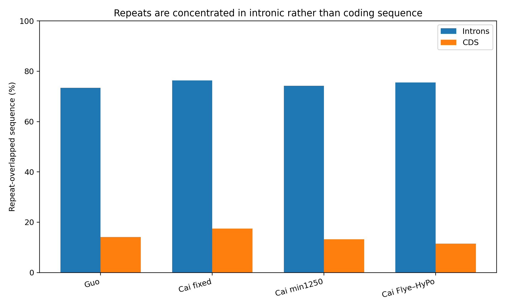
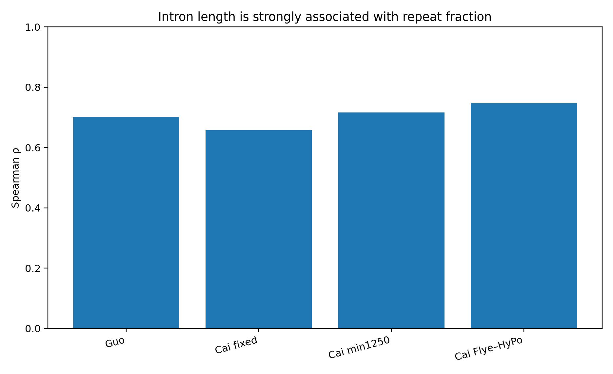
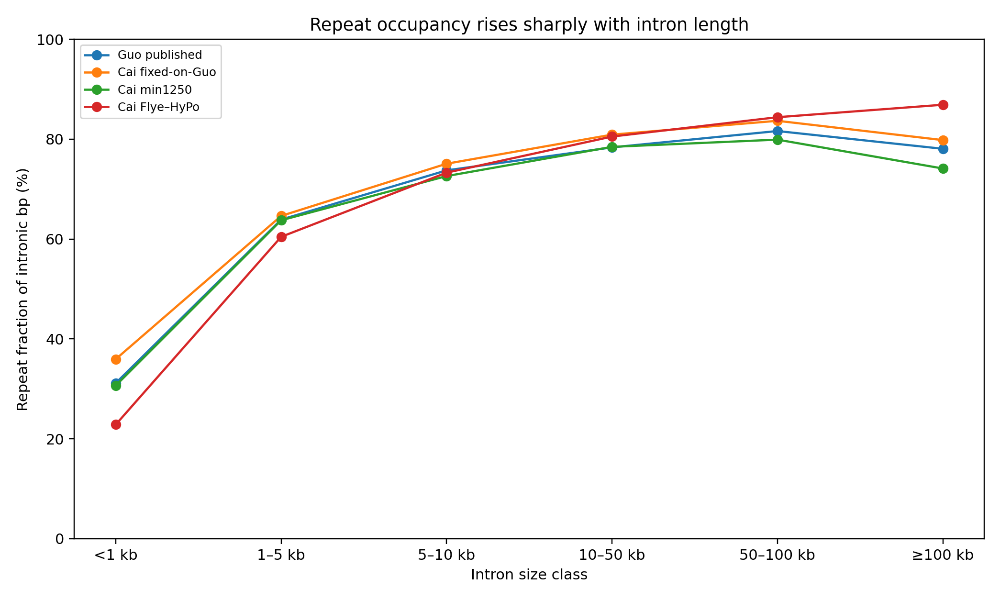
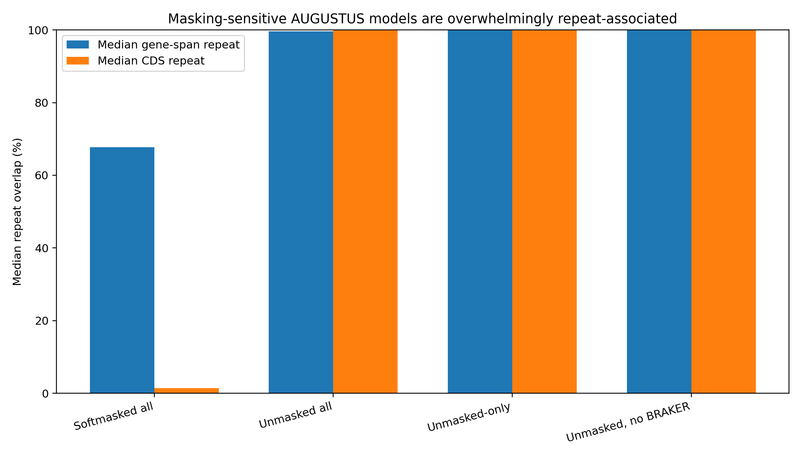
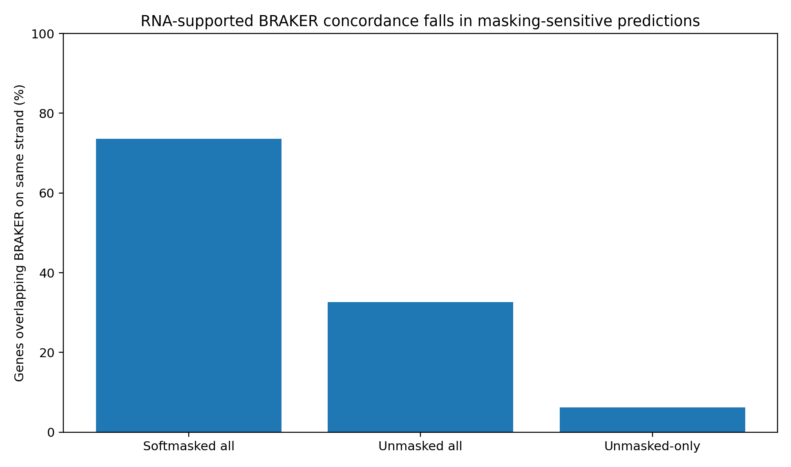

# Phase 5 — Structural Gene Annotation and Repeat-Aware Interpretation

**Status: Phase 5A and core Phase 5B complete**

## Objective

Phase 5 asks how stable gene annotation remains across alternative *Sapria himalayana* genome representations and how much annotation instability is associated with repetitive sequence.

The standardized softmasked BRAKER3 panel contains:

1. **Guo published**
2. **Cai fixed-on-Guo**
3. **Cai min1250**
4. **Cai Flye–HyPo**

The same three Guo paired-end RNA-seq libraries were mapped independently to each genome representation and used as BRAKER3 evidence. No protein evidence was supplied.

A separate standalone AUGUSTUS experiment holds the Guo genome and trained predictor constant while changing repeat visibility.

Raw Phase 5A GFF3 files are archived on Zenodo: **https://doi.org/10.5281/zenodo.23072450**

---

## 1. Standardized BRAKER3 annotation scale

| Representation | Genes | Transcripts | Gene density |
|---|---:|---:|---:|
| **Guo published** | **29,792** | **34,471** | **14.46/Mb** |
| **Cai fixed-on-Guo** | **29,887** | **34,783** | **14.50/Mb** |
| **Cai min1250** | **20,149** | **24,733** | **16.19/Mb** |
| **Cai Flye–HyPo** | **19,430** | **23,822** | **20.10/Mb** |

Guo and Cai fixed-on-Guo remain nearly identical at global annotation scale.

Cai min1250 and Cai Flye–HyPo differ by **22.3% in assembly span** but only ~**3.6–3.7%** in gene/transcript count.

Cai Flye–HyPo also gives a substantially higher start+stop structural-completeness proxy than Cai min1250.

---

# Phase 5B — Repeat-aware annotation

## 2. Repeat expansion is concentrated in introns

One representative transcript per gene was selected by **longest total CDS length**, with transcript span and transcript ID used as deterministic tie-breakers.

| Representation | Representative introns | Weighted intron repeat | Weighted CDS repeat | Spearman ρ: intron length vs repeat fraction |
|---|---:|---:|---:|---:|
| **Guo published** | 107,624 | **73.45%** | **14.12%** | **0.702** |
| **Cai fixed-on-Guo** | 116,488 | **76.30%** | **17.41%** | **0.658** |
| **Cai min1250** | 81,668 | **74.20%** | **13.18%** | **0.716** |
| **Cai Flye–HyPo** | 77,610 | **75.49%** | **11.45%** | **0.748** |

Across all four standardized annotations, approximately **73–76% of representative intronic sequence overlaps RepeatMasker intervals**, compared with only **11–17% of representative CDS sequence**.

The intron-versus-CDS repeat ratio is approximately **4.4–6.6×**.

This provides direct support for the working model of **repeat-expanded gene architecture**: repetitive sequence penetrates gene space primarily through introns rather than coding sequence.

---

## 3. Longer introns are consistently more repeat-rich

The positive intron-length/repeat relationship is reproducible across all four representations:

- Guo: **ρ = 0.702**
- Cai fixed-on-Guo: **ρ = 0.658**
- Cai min1250: **ρ = 0.716**
- Cai Flye–HyPo: **ρ = 0.748**

The size-bin analysis makes the pattern easier to interpret:

- introns <1 kb: only ~**23–36%** of intronic bp are repeat-overlapped;
- 1–5 kb: ~**60–65%**;
- 5–10 kb: ~**73–75%**;
- 10–50 kb: ~**78–81%**;
- 50–100 kb: ~**80–84%**.

Introns ≥10 kb contain approximately **71–77% of all repeat-overlapped intronic sequence** depending on representation.

The earlier exploratory Guo correlation near ρ≈0.740 is therefore not discarded; the standardized panel shows that the same biological pattern survives annotation replacement and genome representation changes.

---

## 4. Extreme introns are stable under the Guo → Cai-fixed sequence control

Using overlapping gene coordinates on the shared Guo/Cai-fixed scaffold system:

- **90.22%** of Guo genes whose longest intron is ≥10 kb have an overlapping Cai-fixed model that also remains ≥10 kb.
- **91.06%** of Guo genes whose longest intron is ≥50 kb remain in the ≥50-kb class.
- all **five** Guo loci with a longest intron ≥100 kb retain an overlapping Cai-fixed model with a ≥100-kb intron.

For those five ≥100-kb loci, the longest-intron lengths are effectively unchanged and the repeat fractions remain similar.

This strengthens the interpretation that extreme intron architecture is not merely a consequence of fixed Cai-versus-Guo nucleotide substitutions.

The coordinate-overlap comparison is a structural robustness test, not a formal orthology analysis.

---

## 5. The AUGUSTUS masking experiment now has direct repeat evidence

Standalone AUGUSTUS previously showed a dramatic masking effect:

- softmasked Guo: **30,906 genes**
- unmasked Guo: **106,782 genes**

Repeat overlap now explains much of that inflation.

### Unmasked predictions with no same-strand softmasked AUGUSTUS overlap

There are **60,530** such models.

Among them:

- median gene-span repeat fraction: **100%**
- median CDS repeat fraction: **100%**
- **97.41%** have at least half of their gene span inside RepeatMasker intervals
- only **6.21%** overlap an RNA-supported BRAKER gene on the same strand

### Unmasked predictions with no same-strand BRAKER overlap

There are **71,886** models.

Among them:

- median gene-span repeat fraction: **100%**
- median CDS repeat fraction: **100%**
- **97.04%** have at least half of their gene span in repeats
- **96.73%** have at least half of their CDS in repeats

The conclusion can therefore be strengthened:

> **Exposing repetitive sequence to standalone AUGUSTUS creates a large repeat-associated prediction space that is mostly absent from the softmasked run and poorly concordant with RNA-supported BRAKER annotation.**

These models should not all be called “false genes.” Some may represent transposable-element proteins or genuine repeat-associated loci. But they are clearly not equivalent to the primary host-gene annotation set.

Softmasking greatly reduces this problem but does not eliminate it: the subset of softmasked AUGUSTUS predictions lacking BRAKER overlap is itself strongly repeat-associated.

---

## 6. Phase 5 conclusions

Phase 5 now supports five linked conclusions:

1. **Annotation scale is stable under the Guo → Cai-fixed sequence control.**
2. **Independent Cai reconstruction changes assembly span much more than it changes predicted gene count.**
3. **Long and giant introns are robust structural features across genome representations.**
4. **Repeat occupancy rises strongly with intron length, while coding sequence is much less repeat-overlapped.**
5. **Repeat visibility directly drives large-scale ab initio annotation inflation in AUGUSTUS.**

Together, these results connect the assembly problem to the annotation problem:

**repeat-rich sequence → reconstruction sensitivity → repeat-expanded introns → annotation sensitivity**

---

## Data files

Compact Phase 5B results are under [`tables/`](tables/).

Detailed per-intron and per-gene overlap tables are better suited to archival deposition than ordinary Git history.
