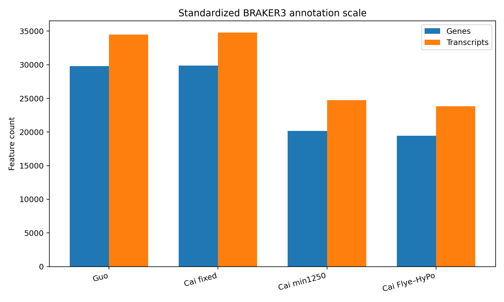
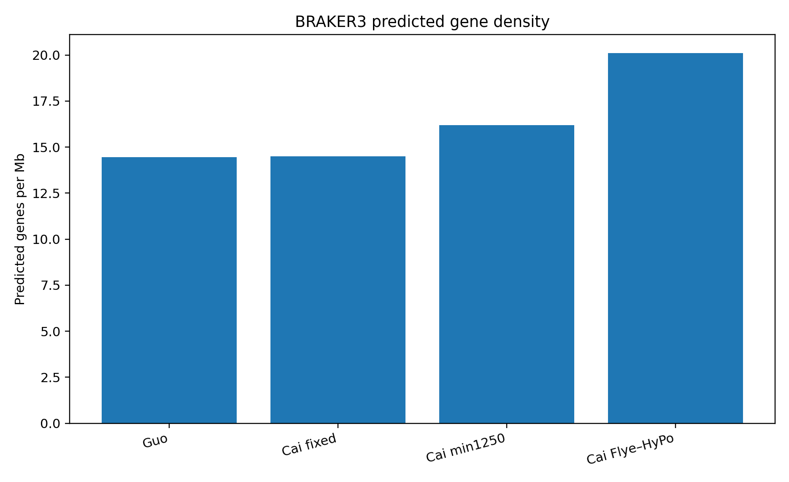
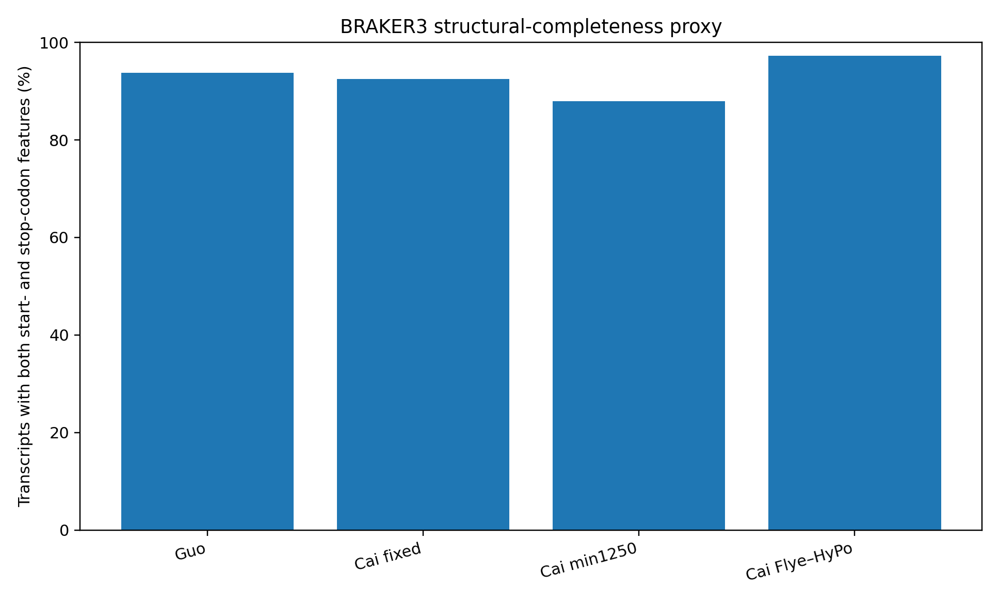
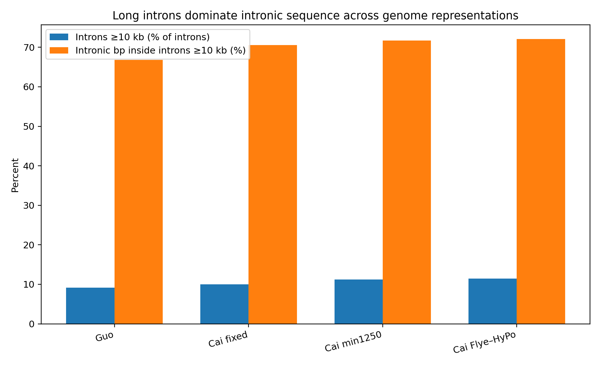
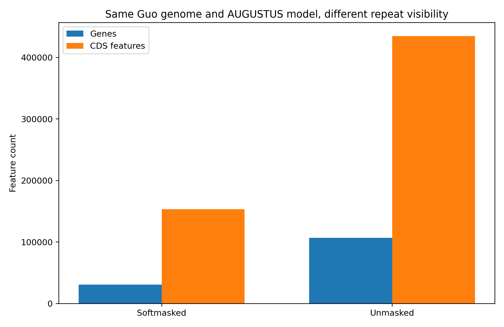

# Phase 5 — Structural Gene Annotation

**Status: Active — Phase 5A structural comparison complete; Phase 5B repeat-aware interpretation pending Phase 4**

## Objective

Phase 5 asks how stable gene annotation remains when the same biological system is represented by different genome reconstructions and when repetitive sequence is exposed or masked.

The current standardized BRAKER3 panel contains four softmasked genome representations:

1. **Guo published**
2. **Cai fixed-on-Guo**
3. **Cai min1250**
4. **Cai Flye–HyPo**

Per the project workflow, the same three Guo paired-end RNA-seq libraries were mapped independently to each genome representation and supplied to BRAKER3. No protein evidence was used.

A separate controlled AUGUSTUS experiment holds the Guo genome and trained model constant while changing repeat visibility (softmasked versus unmasked).

Raw GFF3 files are intended for **Zenodo**, not ordinary Git history. GitHub stores the compact summaries, figures, scripts, checksums, and interpretation.

---

## Input integrity

All six uploaded GFF3 files passed basic structural checks:

- no malformed feature lines;
- no invalid coordinates;
- no invalid strand values;
- no duplicated gene IDs;
- no duplicated transcript IDs;
- no unresolved parent IDs.

AUGUSTUS uses repeated CDS IDs for discontinuous CDS segments, which is valid GFF3 behavior and is not treated as an error.

See [`tables/phase5_gff_validation.tsv`](tables/phase5_gff_validation.tsv).

---

## 1. Standardized BRAKER3 annotation scale

| Representation | Assembly span | Genes | Transcripts | Gene density (/Mb) | Transcripts with start + stop |
|---|---:|---:|---:|---:|---:|
| **Guo published** | 2.061 Gb | **29,792** | **34,471** | **14.46** | **93.81%** |
| **Cai fixed-on-Guo** | 2.061 Gb | **29,887** | **34,783** | **14.50** | **92.47%** |
| **Cai min1250** | 1.244 Gb | **20,149** | **24,733** | **16.19** | **88.00%** |
| **Cai Flye–HyPo** | 0.966 Gb | **19,430** | **23,822** | **20.10** | **97.30%** |

### Main interpretation

**Guo and Cai fixed-on-Guo are globally stable at annotation scale.** Their assembly spans are nearly identical; Cai-fixed differs from Guo by only **+0.32% genes** and **+0.91% transcripts**. This supports the intended role of Cai fixed-on-Guo as a sequence-divergence control. Their internal gene structures are not identical, however, so the control should not be described as annotation-identical.

**The two Cai structural representations converge surprisingly well.** Cai min1250 and Cai Flye–HyPo differ by **22.3% in assembly span**, but only **3.6% in gene count** and **3.7% in transcript count** under the same annotation strategy.

**Gene count falls less steeply than assembly span.** Relative to Guo, Cai Flye–HyPo is **53.1% smaller in assembled span** but contains only **34.8% fewer BRAKER genes**. Consequently, predicted gene density rises from **14.46 genes/Mb** in Guo to **20.10 genes/Mb** in Cai Flye–HyPo.

This does not prove that the sequence absent from the smaller assembly is non-genic or artifactual. Repeat-aware analysis in Phase 5B is required before assigning a biological explanation.

---

## 2. Cai Flye–HyPo improves the structural-completeness proxy

The GFF3 files explicitly report `start_codon` and `stop_codon` features. We therefore use the fraction of transcripts containing **both** as a structural-completeness proxy.

This is not a functional validation and does not guarantee that a predicted protein is biologically correct.

The clearest contrast is between the two Cai genome representations:

- **Cai min1250:** 88.00% of transcripts have both start and stop codons.
- **Cai Flye–HyPo:** 97.30%.
- Using one longest-CDS representative transcript per gene, the corresponding values are **85.54%** and **96.83%**.

Thus, the independently reconstructed, gap-free Cai Flye–HyPo genome yields almost the same annotation scale as Cai min1250 while producing substantially fewer partial gene models.

The improvement is strongest for missing starts: Cai min1250 contains many more stop-only or neither-start-nor-stop models than Cai Flye–HyPo.

---

## 3. Long-intron architecture is robust across all four annotations

For structural comparison, one representative transcript per gene was selected using the **longest total CDS length**, with transcript span and transcript ID used only as deterministic tie-breakers.

| Representation | Representative introns | Median intron | Introns ≥10 kb | Intronic bp inside ≥10-kb introns | Maximum intron |
|---|---:|---:|---:|---:|---:|
| **Guo published** | 107,624 | 194 bp | **9.13%** | **66.80%** | 115,994 bp |
| **Cai fixed-on-Guo** | 116,488 | 159 bp | **10.02%** | **70.57%** | 115,994 bp |
| **Cai min1250** | 81,668 | 175 bp | **11.18%** | **71.74%** | 129,246 bp |
| **Cai Flye–HyPo** | 77,610 | 162 bp | **11.44%** | **72.08%** | 105,468 bp |

This is one of the strongest Phase 5A results:

> **Only ~9–11% of representative introns are at least 10 kb long, yet they contain ~67–72% of all representative intronic sequence.**

The long-intron burden therefore survives major changes in genome representation and annotation substrate. RepeatMasker overlap is still required before attributing that burden to specific repeat classes.

The current ≥100-kb intron candidates are listed in [`tables/phase5_giant_introns_ge100kb.tsv`](tables/phase5_giant_introns_ge100kb.tsv).

---

## 4. Repeat masking changes standalone AUGUSTUS dramatically

The controlled AUGUSTUS experiment uses the same Guo genome sequence coordinates and the same trained model, changing only whether softmasking is visible to the predictor.

| Metric | Softmasked | Unmasked | Unmasked / softmasked |
|---|---:|---:|---:|
| Genes | **30,906** | **106,782** | **3.46×** |
| CDS features | **153,165** | **434,794** | **2.84×** |
| Total predicted CDS bp | **29.29 Mb** | **90.41 Mb** | **3.09×** |
| Median gene span | **3,856 bp** | **1,776 bp** | **0.46×** |
| Scaffolds with predictions | **8,953** | **16,025** | — |

Every scaffold receiving a softmasked AUGUSTUS prediction also receives an unmasked prediction, while **7,072 additional scaffolds** gain predictions when repetitive sequence is exposed.

Comparison with the RNA-supported Guo BRAKER annotation strengthens the pattern:

- **73.62%** of softmasked AUGUSTUS genes overlap a BRAKER gene on the same strand.
- only **32.68%** of unmasked AUGUSTUS genes do so.
- **71,886** unmasked AUGUSTUS models have no same-strand overlap with a BRAKER gene.
- those no-overlap unmasked models are shorter (median gene span ≈ **1,295 bp**) than unmasked models that overlap BRAKER (≈ **3,021 bp**).

These results show that exposing masked sequence generates a very large additional prediction space enriched for short models outside the RNA-supported annotation.

They do **not** yet prove that the additional models are repeat-derived false positives. That claim requires the Phase 4 RepeatMasker GFF overlap.

---

## 5. Important baseline reset for the giant-intron analysis

Earlier RE-SAPRIA exploration used a different Guo working annotation with **18,448 representative transcripts**, **85,501 introns**, and a maximum intron of **160,996 bp**.

The standardized Phase 5 Guo BRAKER3 file supplied here contains **29,792 genes** and yields **107,624 representative introns** under the longest-CDS rule, with a maximum representative intron of **115,994 bp**.

Therefore:

> **The earlier repeat–intron correlation and giant-intron counts must not be mixed directly with this standardized Phase 5 annotation.**

The previous exploratory result remains useful provenance, but repeat overlap, long-intron statistics, and any final correlation must be recomputed against the standardized Phase 5 gene set once the remaining Phase 4 RepeatMasker output is complete.

---

## 6. What Phase 5A establishes

Current evidence supports four conclusions:

1. **Cai fixed-on-Guo behaves as a stable global annotation-scale control** relative to Guo.
2. **Cai min1250 and Cai Flye–HyPo converge on similar BRAKER gene/transcript counts** despite a large assembly-span difference.
3. **The gap-free Cai Flye–HyPo reconstruction produces markedly more structurally complete gene models** than filtered published Cai under the start/stop-codon proxy.
4. **Long-intron architecture is robust across genome representations**, while standalone AUGUSTUS is extremely sensitive to repeat visibility.

None of these conclusions requires the unfinished Cai-original RepeatMasker run.

---

## 7. Phase 5B — repeat-aware interpretation

Once Phase 4 is complete, the next analyses are:

- gene/CDS/exon overlap with RepeatMasker features;
- repeat occupancy of the unmasked-only AUGUSTUS prediction space;
- repeat overlap of BRAKER-supported versus unsupported models;
- repeat composition within ≥10-kb, ≥50-kb, and ≥100-kb introns;
- re-analysis of intron length versus repeat fraction using the standardized Phase 5 gene set;
- confidence sets based on transcript evidence, repeat burden, orthology, and predictor agreement;
- manual browser examples of representative robust, unstable, and giant-intron loci.

Until those analyses are complete, the additional unmasked AUGUSTUS models should be described as **masking-sensitive predictions**, not automatically as false genes.

---

## Data availability

The raw Phase 5 GFF3 files are intended for Zenodo. A checksum and naming manifest is stored in:

[`tables/phase5_zenodo_manifest.tsv`](tables/phase5_zenodo_manifest.tsv)

The GitHub repository should retain only compact derivatives and documentation.

A suggested Zenodo file layout and metadata note are in [`zenodo/README.md`](zenodo/README.md).
