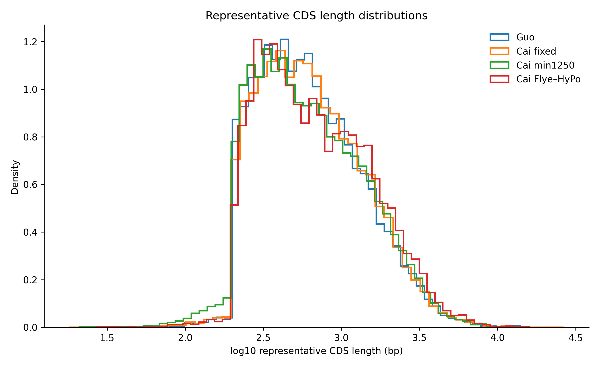
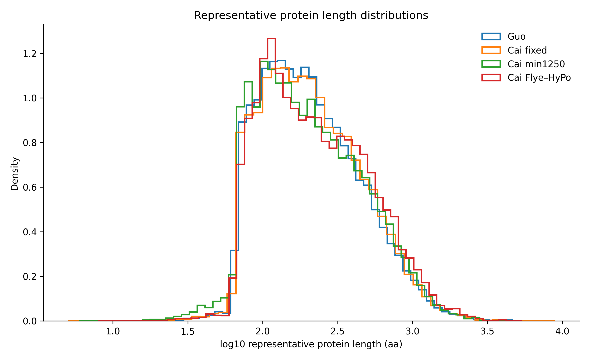
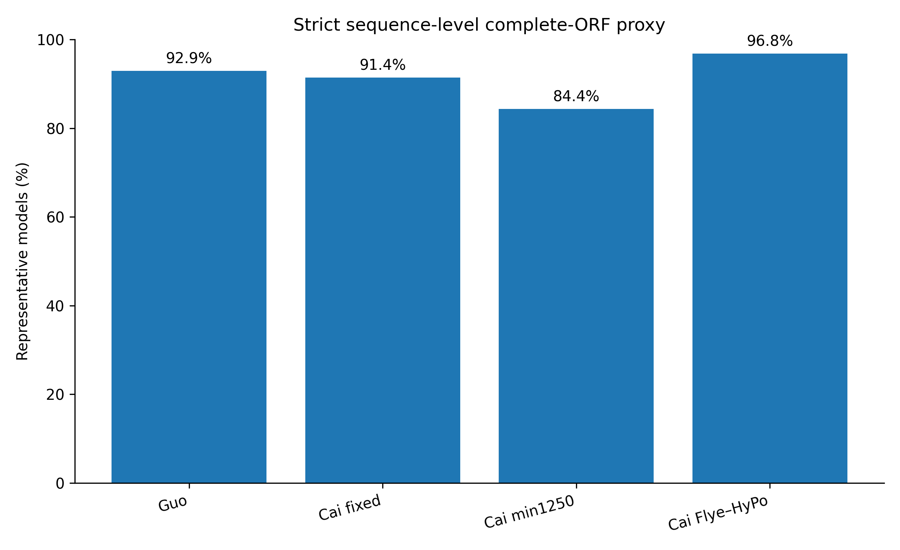
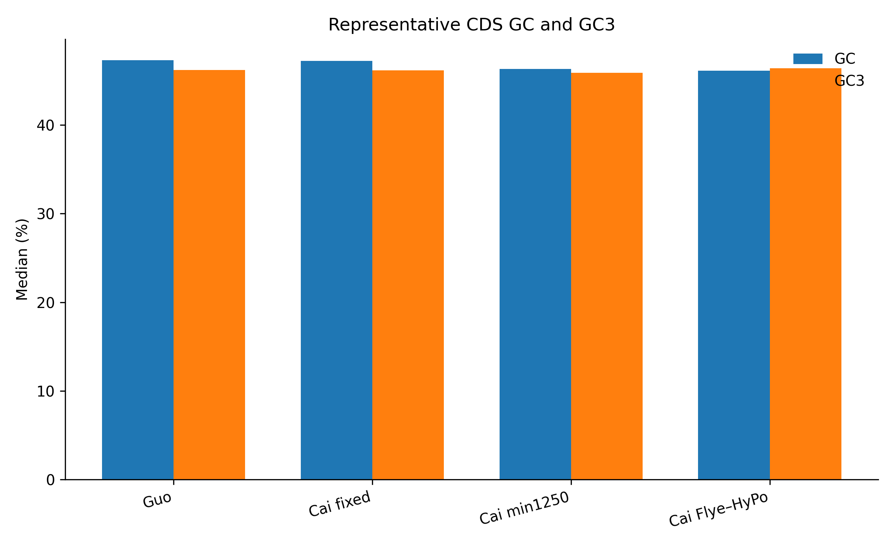
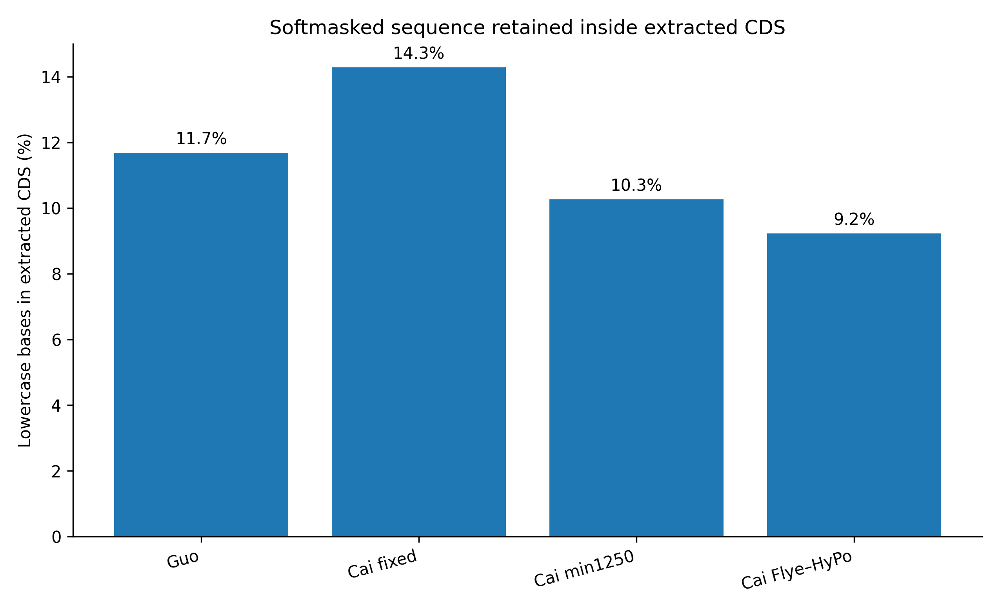

# Phase 6 — Functional and Comparative Genomics

**Status: Early Phase 6 active — structural candidate triage and CDS/PEP sequence QC complete; functional annotation is next**

Phase 6 asks which gene models and biological interpretations remain credible after the reconstruction-, repeat-, and annotation-sensitivity tests established in Phases 3–5.

The current workflow has three layers:

1. **6A — structural candidate triage:** identify repeat-expanded and giant-intron gene models worth carrying forward;
2. **6B — sequence preparation and QC:** extract CDS/peptides, choose one representative transcript per gene, and validate sequence-level properties;
3. **6C — functional/comparative annotation:** DIAMOND, domains, orthology, pathways, and codon-aware comparative analyses.

---

# 1. Early repeat-expanded gene candidates

A conservative **Tier A** candidate requires:

- a representative transcript with explicit start and stop codons;
- longest intron ≥50 kb;
- total intronic repeat fraction ≥75%;
- CDS repeat fraction ≤10%.

A broader **Tier B** set uses the same criteria but lowers the longest-intron threshold to ≥10 kb.

| Representation | Tier A genes | Tier B genes | Genes with longest intron ≥100 kb |
|---|---:|---:|---:|
| **Guo published** | **179** | 1,622 | **5** |
| **Cai fixed-on-Guo** | **166** | 1,852 | **6** |
| **Cai min1250** | **160** | 1,823 | **7** |
| **Cai Flye–HyPo** | **183** | 2,242 | **4** |

These are **structural candidate gene models**, not yet functionally validated genes and not yet cross-representation ortholog sets.

Detailed candidate tables:

- [`phase6_early_TierA_Guo.tsv`](tables/phase6_early_TierA_Guo.tsv)
- [`phase6_early_TierA_Cai_fixed.tsv`](tables/phase6_early_TierA_Cai_fixed.tsv)
- [`phase6_early_TierA_Cai_min1250.tsv`](tables/phase6_early_TierA_Cai_min1250.tsv)
- [`phase6_early_TierA_Cai_FlyeHyPo.tsv`](tables/phase6_early_TierA_Cai_FlyeHyPo.tsv)
- [`phase6_early_candidate_counts.tsv`](tables/phase6_early_candidate_counts.tsv)

All five Guo loci whose longest representative intron is ≥100 kb retain an overlapping Cai fixed-on-Guo model with a ≥100-kb intron. These loci are priority targets for later domain annotation, orthology analysis, repeat-composition inspection, and manual browser review.

---

# 2. Representative longest-CDS set

CDS and peptide sequences were extracted with `gffread` from each standardized BRAKER3 annotation using the corresponding softmasked genome.

One representative transcript per gene was selected by **maximum extracted CDS length**.

| Representation | All transcripts | Representative genes/proteins | Multi-isoform genes | Exact longest-CDS ties |
|---|---:|---:|---:|---:|
| **Guo published** | 34,471 | **29,792** | 3,247 | 27 |
| **Cai fixed-on-Guo** | 34,783 | **29,887** | 3,362 | 34 |
| **Cai min1250** | 24,733 | **20,149** | 3,164 | 29 |
| **Cai Flye–HyPo** | 23,822 | **19,430** | 3,047 | 20 |

The representative counts exactly match the standardized Phase 5 BRAKER gene counts.

For the small number of exact CDS-length ties, transcript ID was used deterministically because transcript-span metadata was not present in the FASTA-only extraction package. The locked Phase 5 structural rule used transcript span and then transcript ID after longest CDS; therefore only this small tied subset could differ from the structural representative list.

Full mapping: [`representative_longest_CDS_mapping.tsv`](tables/representative_longest_CDS_mapping.tsv)

Exact ties: [`longest_CDS_exact_ties.tsv`](tables/longest_CDS_exact_ties.tsv)

---

# 3. CDS and peptide sequence QC

## Summary table

| Representation | Median rep CDS | Median rep protein | Canonical ATG start | Terminal stop | Strict complete-ORF proxy | Internal-stop models | Softmasked bases in extracted CDS |
|---|---:|---:|---:|---:|---:|---:|---:|
| **Guo published** | 579 bp | 192 aa | 94.84% | 97.78% | **92.94%** | 0.20% | 11.69% |
| **Cai fixed-on-Guo** | 591 bp | 196 aa | 93.52% | 97.41% | **91.42%** | 0.28% | 14.29% |
| **Cai min1250** | 564 bp | 187 aa | 88.94% | 92.89% | **84.37%** | 0.73% | 10.26% |
| **Cai Flye–HyPo** | 621 bp | 206 aa | 97.81% | 98.84% | **96.84%** | 0.11% | 9.22% |

Full table: [`sequence_QC_summary.tsv`](tables/sequence_QC_summary.tsv)

The sequence-level results independently reproduce the Phase 5 structural pattern: **Cai Flye–HyPo yields the cleanest representative gene models, whereas Cai min1250 retains the highest burden of incomplete/ambiguous models.**

## Representative CDS length

## Representative protein length

## Strict complete-ORF proxy

The strict proxy requires a canonical `ATG` start, terminal stop codon, in-frame CDS length, no internal in-frame stop, and no ambiguous nucleotide.

It is a **sequence-QC proxy**, not functional validation.

---

# 4. GC, GC3, and softmasked sequence inside CDS

Median representative GC and GC3 values remain broadly similar across representations.

Lowercase sequence inherited from the softmasked genome is retained inside some extracted CDS models:

This lowercase fraction is useful as a sequence-level warning signal, but **coordinate-level RepeatMasker overlap from Phase 5B remains the authoritative repeat analysis**.

---

# 5. CDS ↔ peptide translation concordance

Guo, Cai fixed-on-Guo, and Cai Flye–HyPo representative CDS/peptide pairs are fully concordant under the standard genetic code.

Cai min1250 contains **34 representative translation exceptions (~0.17%)**, all associated with ambiguous `N` sequence rather than clean contradictory CDS/peptide calls.

Full exception list: [`translation_concordance_exceptions_representatives.tsv`](tables/translation_concordance_exceptions_representatives.tsv)

These exceptions are retained for review rather than automatically discarded.

---

# 6. Exact sequence redundancy

Exact duplicate representative peptide sequences are much more frequent in Guo and Cai fixed-on-Guo than in the two Cai structural reconstructions.

| Representation | Representative genes | Unique rep CDS | Duplicate rep CDS | Unique rep proteins | Duplicate rep proteins |
|---|---:|---:|---:|---:|---:|
| **Guo published** | 29,792 | 27,246 | 2,546 | 27,134 | **2,658** |
| **Cai fixed-on-Guo** | 29,887 | 27,609 | 2,278 | 27,524 | **2,363** |
| **Cai min1250** | 20,149 | 19,890 | 259 | 19,862 | **287** |
| **Cai Flye–HyPo** | 19,430 | 19,405 | 25 | 19,401 | **29** |

Full table: [`exact_sequence_duplicate_summary.tsv`](tables/exact_sequence_duplicate_summary.tsv)

These duplicates are **not automatically redundant annotations**. They may arise from genuine duplicated loci, isoform/model behavior, reconstruction differences, collapsed/expanded repeat-associated predictions, or other causes. They must be resolved before making gene-family expansion claims.

---

# 7. Codon-aware analysis pool

A strict sequence-quality CDS pool was generated as a **prefilter** for later codon-aware comparative analyses.

| Representation | Representative genes | Strict sequence-level CDS candidates | Candidate fraction |
|---|---:|---:|---:|
| **Guo published** | 29,792 | **27,689** | 92.94% |
| **Cai fixed-on-Guo** | 29,887 | **27,323** | 91.42% |
| **Cai min1250** | 20,149 | **17,000** | 84.37% |
| **Cai Flye–HyPo** | 19,430 | **18,816** | 96.84% |

Full table: [`KaKs_candidate_pool_summary.tsv`](tables/KaKs_candidate_pool_summary.tsv)

This is **not yet a Ka/Ks dataset**. Ka/Ks requires defensible ortholog pairs, protein/codon-aware alignment, and an appropriate substitution model.

Additional sequence summaries:

- [`codon_usage_representatives.tsv`](tables/codon_usage_representatives.tsv)
- [`amino_acid_composition_representatives.tsv`](tables/amino_acid_composition_representatives.tsv)
- [`flagged_representative_models_for_review.tsv.gz`](tables/flagged_representative_models_for_review.tsv.gz)

---

# 8. Functional annotation — next step

The representative protein FASTAs are now the canonical Phase 6 functional inputs.

**Locked direction:**

**representative longest-CDS proteins → DIAMOND/Swiss-Prot → NR rescue → InterPro/Pfam → eggNOG → OrthoFinder/BUSCO protein mode → integrated functional evidence**

### Protein FASTA

Primary uses:

- DIAMOND `blastp` against **Swiss-Prot**;
- broader **NR rescue** for weak/no Swiss-Prot matches;
- InterProScan / Pfam;
- eggNOG-mapper;
- OrthoFinder;
- BUSCO protein mode.

### CDS FASTA

Retained for:

- nucleotide-level homology;
- orthology-confirmed codon analyses;
- Ka/Ks after codon-aware alignment;
- sequence validation;
- transcript/gene reconstruction checks.

A no-hit protein in Swiss-Prot is **not** evidence of novelty.

---

# 9. Current interpretation

Early Phase 6 now adds a sequence-level layer to the Phase 5 structural results:

1. **The representative longest-CDS sets reproduce the standardized BRAKER gene counts exactly.**
2. **Flye–HyPo retains fewer partial/ambiguous models than Cai min1250**, consistent with the earlier start/stop structural-completeness result.
3. **Most CDS/peptide pairs are internally coherent**, with the only representative translation exceptions concentrated in ambiguous Cai min1250 sequence.
4. **Guo and Cai fixed-on-Guo contain substantially more exact duplicate representative proteins**, a pattern that must be accounted for before interpreting gene-family expansion.
5. **Repeat-expanded giant-intron candidates are now ready for functional and orthology testing**, but remain structural candidates until independent evidence is added.

---

# Guardrails

- Sequence-level completeness is a QC proxy, not proof of biological function.
- Non-ATG starts may reflect partial models rather than exotic biology.
- Internal stops require locus-level review.
- Lowercase bases are a FASTA-level softmask signal, not a substitute for RepeatMasker-coordinate overlap.
- Exact duplicate proteins can have biological or annotation causes.
- Apparent gene-family expansions must be checked for duplicated, fragmented, and repeat-derived models.
- A repeat-rich intron does not establish function.
- A Swiss-Prot no-hit is not evidence of novelty.
- Cross-representation robustness should precede strong biological claims.
