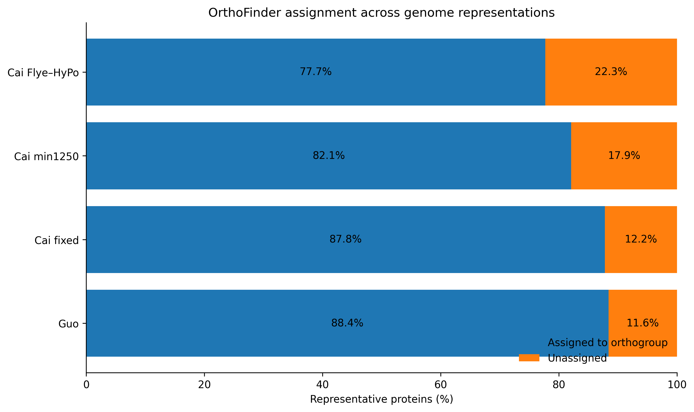
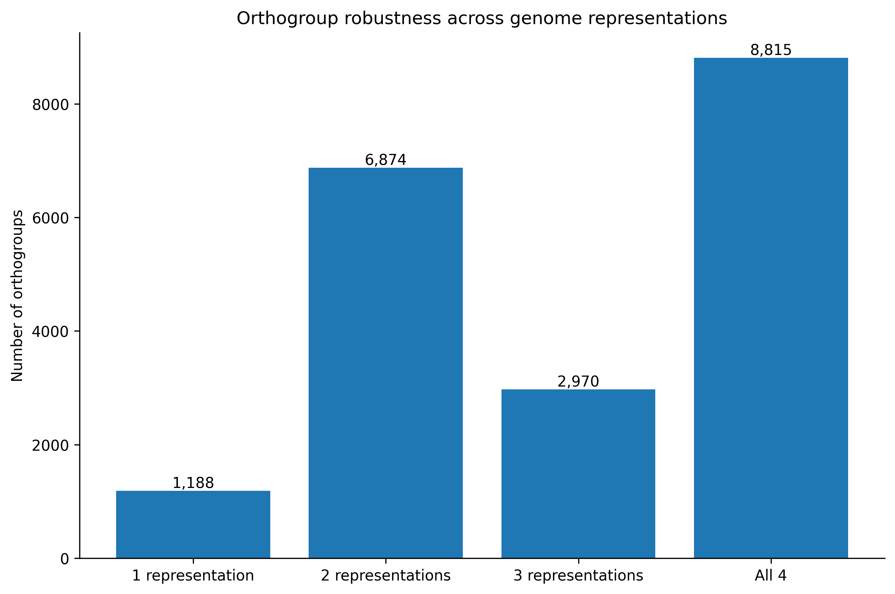

# Phase 6 — Functional and Comparative Genomics

**Status: COMPLETE — frozen 2026-10-04**

Phase 6 tests which gene models and biological interpretations remain credible
after the reconstruction-, repeat-, and annotation-sensitivity analyses
established in Phases 3–5.

The canonical functional input is one representative protein per BRAKER3 gene,
selected primarily by longest total CDS length.

---

## 1. Repeat-expanded structural candidates

A conservative Tier A model requires:

- explicit start and stop codons;
- longest intron ≥50 kb;
- total intronic repeat fraction ≥75%;
- CDS repeat fraction ≤10%.

| Representation | Tier A | Tier B | Longest intron ≥100 kb |
|---|---:|---:|---:|
| Guo published | 179 | 1,622 | 5 |
| Cai fixed-on-Guo | 166 | 1,852 | 6 |
| Cai min1250 | 160 | 1,823 | 7 |
| Cai Flye–HyPo | 183 | 2,242 | 4 |

These remain structural candidates rather than functionally validated genes.

---

## 2. Representative protein sets

| Representation | BRAKER transcripts | Representative proteins |
|---|---:|---:|
| Guo published | 34,471 | 29,792 |
| Cai fixed-on-Guo | 34,783 | 29,887 |
| Cai min1250 | 24,733 | 20,149 |
| Cai Flye–HyPo | 23,822 | 19,430 |

Representative counts exactly match the standardized BRAKER gene counts.

The principal rule was maximum extracted CDS length per gene. Exact CDS-length
ties were resolved deterministically by transcript ID in the FASTA-derived
Phase 6 set.

---

## 3. Sequence-level gene-model QC

| Representation | Median CDS | Median protein | Strict complete-ORF proxy | Internal-stop models |
|---|---:|---:|---:|---:|
| Guo published | 579 bp | 192 aa | 92.94% | 0.20% |
| Cai fixed-on-Guo | 591 bp | 196 aa | 91.42% | 0.28% |
| Cai min1250 | 564 bp | 187 aa | 84.37% | 0.73% |
| Cai Flye–HyPo | 621 bp | 206 aa | 96.84% | 0.11% |

The strict complete-ORF measure is a sequence-QC proxy and not proof of
biological function.

---

## 4. GC composition and softmasked CDS sequence

Coordinate-level RepeatMasker overlap from Phase 5B remains the authoritative
repeat analysis.

---

## 5. Translation concordance and exact redundancy

Guo, Cai fixed-on-Guo, and Cai Flye–HyPo representative CDS/protein pairs are
fully concordant under the standard genetic code.

Cai min1250 contains 34 representative translation exceptions, all associated
with ambiguous sequence.

Exact duplicate representative proteins are considerably more frequent in the
Guo-backbone annotations:

| Representation | Representative proteins | Exact duplicate proteins |
|---|---:|---:|
| Guo published | 29,792 | 2,658 |
| Cai fixed-on-Guo | 29,887 | 2,363 |
| Cai min1250 | 20,149 | 287 |
| Cai Flye–HyPo | 19,430 | 29 |

These duplicates are not automatically biological gene duplications.

---

## 6. Protein homology and functional annotation

Representative proteins were analyzed with:

- DIAMOND blastp against Swiss-Prot;
- DIAMOND blastp against NR;
- eggNOG-mapper;
- InterProScan / Pfam.

### DIAMOND recovery

| Representation | Swiss-Prot hit | NR hit |
|---|---:|---:|
| Guo published | 10,252 | 15,368 |
| Cai fixed-on-Guo | 9,976 | 14,625 |
| Cai min1250 | 7,963 | 10,553 |
| Cai Flye–HyPo | 7,898 | 10,374 |

NR substantially extends detectable protein homology beyond curated
Swiss-Prot.

Absence of a DIAMOND hit is not interpreted as evidence of evolutionary
novelty.

### eggNOG-mapper

| Representation | Representative proteins | eggNOG annotated |
|---|---:|---:|
| Guo published | 29,792 | 13,887 (46.6%) |
| Cai fixed-on-Guo | 29,887 | 13,263 (44.4%) |
| Cai min1250 | 20,149 | 9,851 (48.9%) |
| Cai Flye–HyPo | 19,430 | 9,807 (50.5%) |

eggNOG annotations recover both ordinary plant functions and
repeat/transposon-associated proteins. Repeat-associated assignments are
treated cautiously when evaluating host gene models.

Direct InterProScan/Pfam analyses were completed for all four representative
proteomes and retained as an independent domain-validation layer.

---

## 7. Cross-representation orthogroups

OrthoFinder was used to compare genome representations rather than to infer a
species phylogeny.

Across 99,258 representative proteins:

- 84,230 proteins (84.9%) were assigned to orthogroups;
- 15,028 were unassigned;
- 19,847 orthogroups were recovered;
- 8,815 orthogroups contain all four representations;
- 7,150 are single-copy across all four representations.

| Representation | Assigned | Unassigned |
|---|---:|---:|
| Guo published | 26,350 (88.4%) | 3,442 |
| Cai fixed-on-Guo | 26,244 (87.8%) | 3,643 |
| Cai min1250 | 16,548 (82.1%) | 3,601 |
| Cai Flye–HyPo | 15,088 (77.7%) | 4,342 |

### Representation robustness

| Representations present | Orthogroups |
|---:|---:|
| 1 | 1,188 |
| 2 | 6,874 |
| 3 | 2,970 |
| 4 | 8,815 |

Because all four inputs represent *Sapria himalayana*, these results measure
cross-representation robustness rather than species-level orthology.

---

## 8. BUSCO protein-mode validation

BUSCO 5.8.0 was run in protein mode with `embryophyta_odb10`
(n = 1,614).

| Representation | Complete | Single | Duplicated | Fragmented | Missing |
|---|---:|---:|---:|---:|---:|
| Guo published | 48.0% | 45.7% | 2.3% | 4.6% | 47.4% |
| Cai fixed-on-Guo | 48.4% | 45.7% | 2.7% | 4.4% | 47.2% |
| Cai min1250 | 45.8% | 44.7% | 1.1% | 6.5% | 47.6% |
| Cai Flye–HyPo | 47.1% | 45.8% | 1.4% | 4.9% | 48.0% |

Complete single-copy recovery is nearly invariant between Guo,
Cai fixed-on-Guo, and Cai Flye–HyPo despite their strongly different genome
representations.

The larger fragmented fraction in Cai min1250 agrees with its lower
sequence-level model-completeness proxy.

Duplicated BUSCOs in Guo and Cai fixed-on-Guo are interpreted cautiously
because these representations also contain more exact duplicate proteins.

---

## 9. Candidate Sapria-specific genes

RE-SAPRIA does not make a manuscript-level claim of definitive
*Sapria*-specific or de novo genes.

Proteins lacking convincing Swiss-Prot, NR, eggNOG and InterPro/Pfam support
can be retained as orphan-like candidates, but negative database evidence does
not establish lineage specificity.

The four OrthoFinder inputs are representations/accessions of the same species.
Cross-representation persistence therefore demonstrates reconstruction
robustness rather than evolutionary novelty.

A rigorous lineage-specific analysis will require suitable Rafflesiaceae and
Malpighiales comparators and locus-level genomic validation.

---

## 10. Phase 6 endpoint

Phase 6 completes the functional and comparative validation of the standardized
gene sets.

The project now has:

- repeat-aware structural candidate sets;
- representative CDS and protein sequences;
- sequence-level model QC;
- DIAMOND Swiss-Prot and NR annotation;
- eggNOG functional annotation;
- InterProScan/Pfam domain evidence;
- OrthoFinder cross-representation groups;
- BUSCO protein-mode validation.

No additional exploratory analysis is required for the core RE-SAPRIA
workflow.

**Phase 6 is complete.**

**Next: Phase 7 — manuscript preparation.**

---

## Guardrails

- No-hit does not mean novel.
- OrthoFinder representation-specific groups do not equal lineage-specific genes.
- Exact duplicate proteins do not automatically represent biological duplication.
- BUSCO measures conserved-gene recovery rather than whole-genome completeness.
- InterPro/Pfam absence is negative evidence, not proof of novelty.
- HGT is not inferred from isolated non-plant similarity hits.
- Two accessions are not a population sample.
- Cross-representation robustness should precede strong biological claims.
