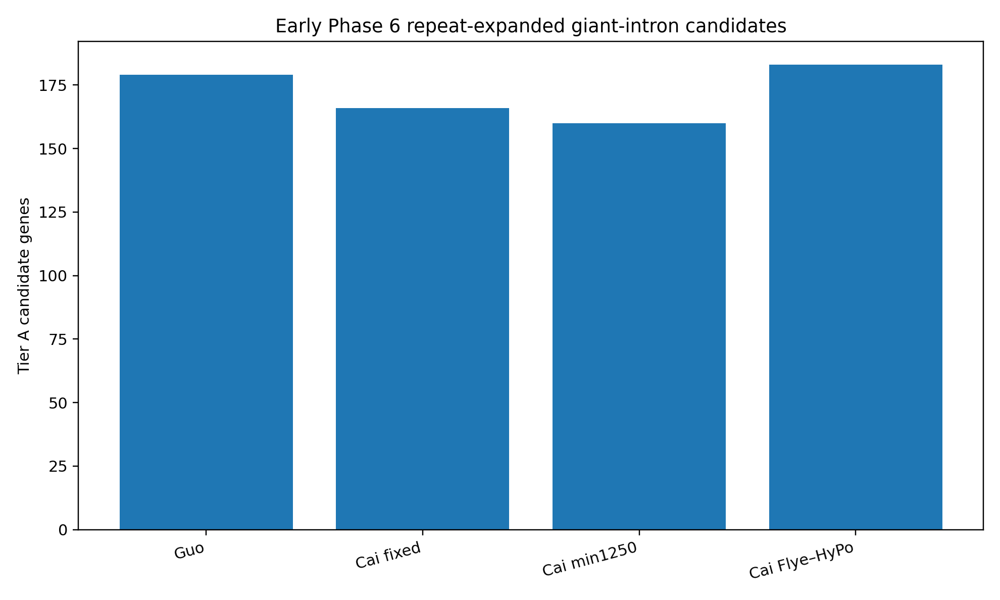

# Phase 6 — Functional and Comparative Genomics

**Status: Beginning — structural candidate triage complete; functional annotation pending protein extraction**

## Objective

Phase 6 assigns functional evidence to structurally robust gene models and asks which biological conclusions survive changes in genome reconstruction, repeat architecture, and annotation strategy.

The first Phase 6 step is deliberately structural: identify loci worth carrying forward before attaching functional labels.

---

## 1. Early repeat-expanded gene candidate sets

A conservative **Tier A** structural candidate requires:

- a representative transcript with explicit start and stop codons;
- longest intron ≥50 kb;
- total intronic repeat fraction ≥75%;
- CDS repeat fraction ≤10%.

Current Tier A counts:

| Representation | Tier A genes |
|---|---:|
| **Guo published** | **179** |
| **Cai fixed-on-Guo** | **166** |
| **Cai min1250** | **160** |
| **Cai Flye–HyPo** | **183** |

A broader Tier B set uses the same criteria but lowers the longest-intron threshold to ≥10 kb.

These are **candidate repeat-expanded host gene models**, not yet functionally validated genes and not yet cross-representation ortholog sets.

The representation-specific candidate tables are under [`tables/`](tables/).

---

## 2. Extreme ≥100-kb intron loci

The standardized annotations contain:

- Guo: **5** genes with a longest intron ≥100 kb
- Cai fixed-on-Guo: **6**
- Cai min1250: **7**
- Cai Flye–HyPo: **4**

All five Guo ≥100-kb loci persist in overlapping Cai-fixed models.

These loci are high-priority candidates for later domain annotation, orthology analysis, repeat-composition inspection, and manual genome-browser review.

---

## 3. Locked functional-annotation direction

Once the BRAKER peptide FASTAs are available, the functional branch will use **one representative protein per gene**, selected from the same longest-total-CDS representative transcript rule used in the structural analysis.

### Protein FASTA — primary functional evidence

Planned analyses:

- **DIAMOND blastp against Swiss-Prot** as the first curated homology layer;
- broader **NR rescue** for weak/no Swiss-Prot matches;
- **InterProScan**;
- **Pfam/domain analysis**;
- **eggNOG-mapper**;
- **OrthoFinder**;
- **BUSCO protein mode**.

Protein-level functional labels will be integrated across evidence sources rather than copied blindly from one top hit.

### CDS FASTA — retained for sequence-level work

Planned uses:

- nucleotide-level homology;
- codon analyses;
- Ka/Ks where appropriate;
- sequence validation;
- transcript/gene reconstruction checks.

---

## 4. Protein extraction rule

For each standardized BRAKER annotation:

1. use the **exact corresponding softmasked genome FASTA** used by that annotation;
2. extract CDS and peptide sequence using `gffread`;
3. preserve all transcript IDs;
4. choose one representative transcript per gene by **longest total CDS length**;
5. retain all isoforms separately for archival/reference purposes;
6. perform basic protein QC before functional annotation.

Protein QC should include internal stop codons, suspiciously short proteins, suspiciously long proteins, and ID mismatches between GFF3 and FASTA.

---

## Interpretation principles

- a repeat-rich intron does not establish function;
- repeat overlap in a CDS requires scrutiny and may indicate TE-associated prediction;
- absence of a Swiss-Prot hit is not evidence of novelty;
- apparent gene-family expansion must be checked for fragmented or repeat-derived models;
- cross-representation robustness should precede strong biological claims.
