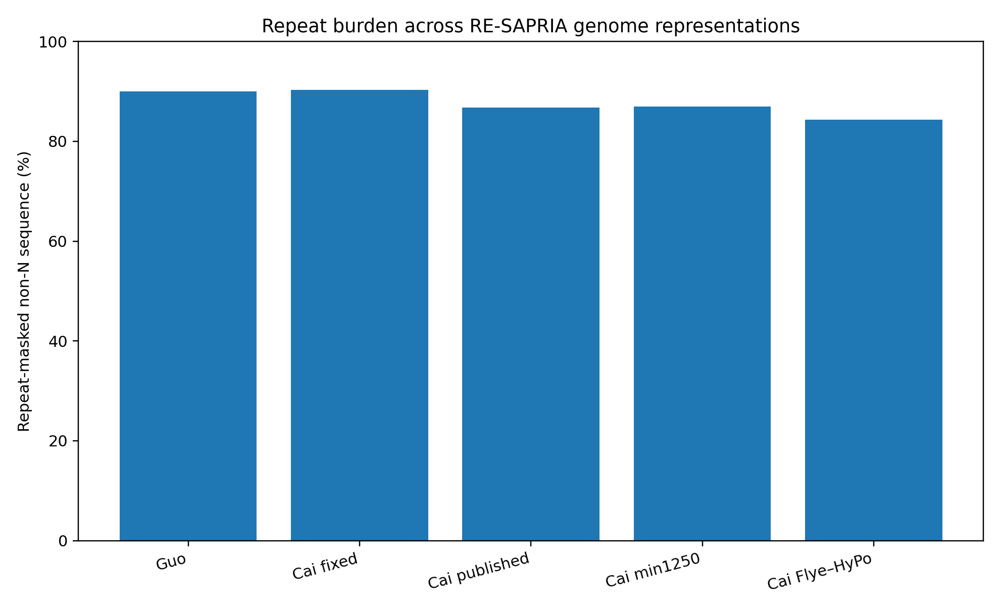
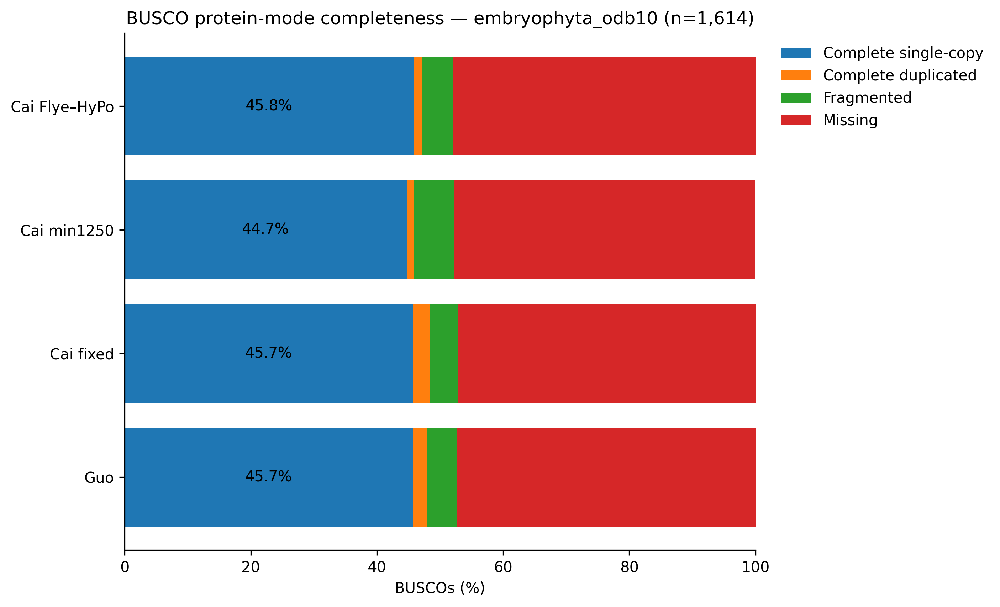

# **Status: ANALYTICALLY FROZEN — MANUSCRIPT DRAFTING**

**Phases 0–7 analytical synthesis is complete and frozen as of 2026-10-04.**

Phase 7 integrates the completed RE-SAPRIA analytical record into manuscript
figures, tables, supplementary materials, methods, and reproducibility outputs.

The final biological object of the study is *Sapria himalayana*. The published
Guo and Cai genomes, together with alternative reconstructed and standardized
representations, are treated as complementary views of the same difficult,
extremely repeat-rich genomic system rather than as the endpoint of a
Guo-versus-Cai comparison.

---

## The three central hypotheses

RE-SAPRIA was organized around three linked hypotheses.

| Hypothesis | Phase 7 answer |
|---|---|
| **1. Biological divergence versus reconstruction** — Differences among *S. himalayana* genome representations reflect an interaction between genuine accession-level sequence divergence and reconstruction-dependent effects. | **Supported.** Independent read and variant evidence supports genuine Cai–Guo sequence divergence, while alternative genome representations show that much of the large-scale span disagreement is reconstruction-sensitive and concentrated in repeat-rich sequence. | **Supported.** Independent sequence evidence supports genuine Cai–Guo divergence, while alternative genome representations demonstrate substantial reconstruction sensitivity. |
| **2. Repeat architecture shapes annotation** — Extreme repeat abundance makes gene prediction sensitive to genome representation, repeat treatment, and annotation strategy. | **Supported.** Repeat visibility and genome representation materially affect the prediction landscape. |
| **3. Giant introns represent repeat-expanded gene space** — Extremely long introns are reproducible genomic features associated with expansion of repetitive sequence inside gene space. | **Structurally supported.** Long introns and their strong repeat association persist across alternative representations. Their broader functional or regulatory significance remains unresolved. |

These conclusions define the analytical endpoint of RE-SAPRIA.

The detailed evidence, interpretation, limitations, and biological implications
will be developed in the manuscript.

---

### Final study framing

RE-SAPRIA is therefore not interpreted as a benchmark of which published
*S. himalayana* genome is "correct." Instead, disagreement among representations
is used as an analytical tool for identifying genomic features that are robust
to reconstruction strategy.

Guo coordinates and BRAKER identifiers are used where a single anchor system is
required for locus reporting. Biological conclusions, however, are made at the
level of *S. himalayana* and are evaluated across alternative genome
representations whenever possible.

---

## Practical annotation recommendation for repeat-rich Rafflesiaceae

RE-SAPRIA supports **soft-masking as the default substrate for primary
structural gene annotation in *Sapria himalayana*.**

In the controlled Guo AUGUSTUS comparison, exposing repetitive sequence
increased predicted gene number from 30,906 in the softmasked genome to
106,782 in the unmasked genome. Most predictions unique to the unmasked
analysis were strongly repeat-associated and showed little concordance with
RNA-supported BRAKER annotation.

Soft-masking therefore substantially suppresses repeat-driven prediction
inflation while retaining repetitive sequence within genuine gene
architecture.

For future *Sapria* and Rafflesiaceae annotation, the recommended workflow is:

**de novo repeat discovery → RepeatMasker soft-masking → evidence-supported
structural annotation → protein/domain validation → post-annotation
repeat-overlap audit**

Unmasked annotation remains valuable as a sensitivity control and for
investigating transposable-element-associated coding space, but should not be
treated as the primary host-gene catalogue without independent evidence.

This recommendation is directly supported for *S. himalayana* and should be
tested rather than assumed to generalize identically across all Rafflesiaceae.

---

## Extreme repeat-expanded gene architecture

Locus-level ranking identified two complementary forms of extreme gene
architecture in *Sapria himalayana*:

1. **giant-intron expansion**, in which one exceptionally long repeat-rich
   intron dominates gene architecture; and
2. **distributed intronic expansion**, in which large repeat burdens accumulate
   across many introns.

Across the four standardized genome representations, the twenty genes with the
largest introns consistently show strong repeat enrichment. Median repeat
occupancy of the longest introns ranges from approximately 80% to 85% in most
representations, demonstrating that giant repeat-rich introns are not restricted
to a single assembly or annotation.

The Guo representation is used as the anchor identifier system for functional
annotation and locus reporting. Cross-representation OrthoFinder groups are
used to evaluate whether corresponding gene models are recovered in Cai
fixed-on-Guo, Cai min1250, and Cai Flye–HyPo representations.

The extreme-gene analysis also shows that the genes with the greatest total
intronic repeat burden are largely distinct from those carrying the single
largest introns. Repeat expansion can therefore enter gene space through
multiple structural routes.

Functional annotation indicates that extreme repeat-expanded loci include
recognizable host genes involved in transcription, RNA metabolism, DNA repair,
transport, membrane trafficking, primary metabolism, and cell-cycle regulation,
rather than being restricted to obvious transposable-element-like predictions.

Functional labels are treated as homology-supported assignments rather than
formal *Sapria* gene names.

Representation-specific ranked tables and cross-representation support tables
are retained as manuscript and supplementary source data.

---

## Two complementary views of genome and gene-space stability

### Repeat burden

Across the five principal genome representations, RepeatMasker masks
approximately **84–90% of non-N sequence**. The representation-level genome
span differences are concentrated overwhelmingly in repeat-rich sequence.

### Conserved coding-space recovery

Despite large differences in assembly span and predicted gene number,
protein-mode BUSCO recovery remains comparatively stable across the four
standardized BRAKER proteomes.

Together, these observations summarize one of the central contrasts emerging
from RE-SAPRIA: **whole-genome representation is highly sensitive to repeat-rich
sequence, whereas the recoverable conserved protein-coding core is much more
stable.**

---

## Manuscript synthesis

The manuscript is being assembled from results generated and documented in
Phases 0–6.

The principal visual narrative follows five analytical transitions:

1. genome representation and read-supported concordance;
2. repeat contribution to representation-level genome-span differences;
3. repeat-expanded intron architecture;
4. repeat-dependent annotation behavior;
5. stability of conserved coding gene space across representations.

Final synthesis figure plates and their compact source tables are versioned in
this Phase 7 directory. The current revised figure set is maintained in
`figures v2/`, with corresponding source tables in `tables v2/`; earlier
versions are retained only as development provenance until repository cleanup.

---

## Figure provenance

Every final figure and table must remain traceable to:

1. its analytical phase;
2. the genome representation used;
3. a compact source table;
4. the software/database version;
5. the corresponding workflow or analysis record.

Phase 7 may redesign or combine existing analyses for presentation, but it does
not create undocumented analytical branches.

---

## Final analytical freeze

RE-SAPRIA reached final analytical freeze on **2026-10-04**.

Phases 0–7 now constitute the frozen analytical record for the current
manuscript. No additional exploratory assembly, annotation, functional
annotation, candidate discovery, or representation-comparison analyses are
planned.

Further analysis should be performed only when:

- necessary to correct an identified analytical or reporting error;
- required to resolve a manuscript-level ambiguity discovered during writing;
- or explicitly requested during peer review.

From this point, project activity is limited to manuscript writing, figure and
table presentation, supplementary documentation, repository curation, and
correction of verified errors.

---

## Scope boundary

RE-SAPRIA does not currently make a definitive claim of *Sapria*-specific or
de novo genes.

Representation-robust orphan-like proteins can be identified in the present
dataset, but lineage-specific gene origin requires suitable external
Rafflesiaceae/Malpighiales comparators and locus-level evolutionary validation.

Similarly, repeat-rich giant introns are treated as robust structural features;
specific regulatory or evolutionary functions require additional evidence.

These questions are retained as future directions rather than forced into the
current manuscript.

---

## Final biological synthesis

Across alternative representations, *Sapria himalayana* shows a consistent
genomic pattern:

**extreme repeat abundance → reconstruction-sensitive genome representation →
repeat-expanded introns → repeat-sensitive gene prediction → comparatively
stable conserved protein-coding space.**

The major representation-level genome-span differences are concentrated in
repeat-rich sequence, while repeat expansion repeatedly penetrates recognizable
host-gene architecture through large introns. At the same time, conserved
protein recovery and cross-representation gene-space structure remain
substantially more stable than whole-genome span.

This synthesis, rather than the disagreement between any two individual genome
assemblies, defines the endpoint of RE-SAPRIA.

---

## Data archives

### Phase 4 — repeat annotation

Zenodo DOI:  
https://doi.org/10.5281/zenodo.23105473

### Phase 5A — standardized BRAKER3 and AUGUSTUS annotations

Zenodo DOI:  
https://doi.org/10.5281/zenodo.23072450

Additional manuscript-associated datasets may be archived with the preprint or
publication.

---

## Contributors

- **Adhityo Wicaksono** — project lead; conceptualization, analysis,
  interpretation, manuscript development
- **Andrian Dary Fawwaz** — research intern; analytical contributions and
  manuscript development
- **Arli Aditya Parikesit** — supervision, interpretation, manuscript
  development

AI-assisted analytical and documentation support was provided using OpenAI
ChatGPT during project development.

---

## Next

**Write the paper.**
