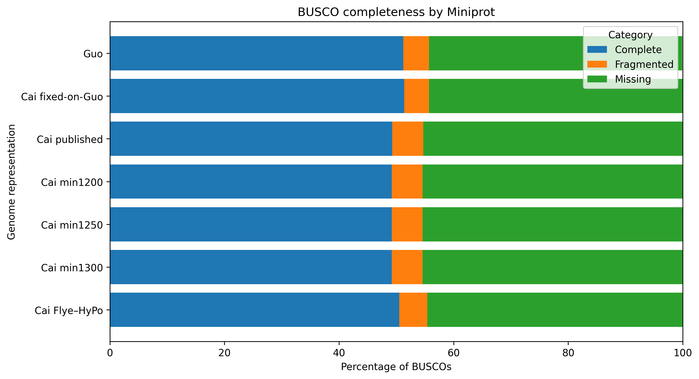

# RE-SAPRIA for Middle School 🌺🧬
## One species, several assemblies: how is that possible?

## Before we begin: what is *Sapria*? And who are “Cai” and “Guo”? 🌺

If you already know **Rafflesia**, you have the perfect starting point.

*Rafflesia* and *Sapria* are not the same plant, but both belong to the family **Rafflesiaceae**—a remarkable group of parasitic flowering plants with extremely reduced vegetative bodies that spend much of their lives hidden inside host tissue.

*Rafflesia* is much more famous because of its enormous flowers. *Sapria himalayana* is a less familiar relative, but it has become one of the best genomic windows into how extreme endoparasitism can reshape a flowering plant.

And one important clarification:

> **“Cai” and “Guo” are not species names.**

In RE-SAPRIA, **Cai** is shorthand for the dataset/assembly from the **Liming Cai et al. (2021)** study. **Guo** is shorthand for the dataset/assembly from the **Xuelian Guo et al. (2023)** study.

So we are comparing **two different scientific studies of the same species: *Sapria himalayana*.**

## Two scientific journeys into the *Sapria* genome

### The Cai journey: from an almost invisible plant body to a genome

Charles C. Davis's group at Harvard had studied Rafflesiaceae for years. One of the major challenges was easy to state but difficult to solve: **how do you build a usable genome for a plant that spends most of its life hidden inside another plant?**

Liming Cai made *Sapria himalayana* a major part of his doctoral research. Together with Charles Davis, Timothy Sackton, Harvard bioinformaticians, and collaborators in Southeast Asia, the 2021 study produced one of the most complete genomic views then available for a major Rafflesiaceae lineage.

The study revealed something remarkable: *Sapria* had lost many genes that are normally deeply conserved in flowering plants, yet its genome remained large and structurally unusual. The team also found evidence of horizontal gene transfer from host lineages.

### The Guo journey: returning to the same species with a new dataset

Two years later, **Xuelian Guo** and colleagues from the Chinese Academy of Sciences, Novogene, and collaborating institutions published **another independent genome assembly of *S. himalayana***.

The Guo study was not simply a repeat of Cai. It used a different dataset and emphasized questions including flower development, flowering time, metabolism, defense, gene loss, and horizontal gene transfer.

And that is where RE-SAPRIA finds its new question:

> **If two teams study the same species but produce very different genome representations, which differences reflect biology—and which reflect reconstruction?**

## 1. The assembly puzzle

| Representation | Assembly span |
|---|---:|
| **Guo published** | **2.061 Gb** |
| **Cai published** | **1.276 Gb** |
| **Cai Flye–HyPo** | **0.966 Gb** |

All represent *Sapria himalayana*.

So we ask:

> **Does the difference come from the plant, or from how the genome was reconstructed?**

## 2. Why can assemblies disagree?

A genome is like a giant puzzle. Repeated DNA makes many pieces look alike.

A computer can:

- merge regions that should be separate;
- split regions that should connect;
- leave gaps;
- build long scaffolds from shorter contigs.

Published Cai is a good example:

- scaffold N50 ≈ **952 kb**
- contig N50 ≈ **19 kb**
- gap content ≈ **7.319%**

So a large scaffold N50 does not automatically mean long gap-free sequence.

## 3. Back to the original reads

### Cai ONT → Guo
- primary mapping: **92.68%**
- Guo breadth: **88.11%**

### Cai Illumina → Guo
- primary mapping: **97.87%**
- Guo breadth: **~92.93%**

Most of Guo is still recognized by Cai data.

## 4. But Cai and Guo are not identical

We found:

- **4,535,955** high-confidence small variants;
- **3,704,632** SNPs;
- **831,323** indels;
- **54,117** structural-discrepancy calls.

Real differences exist, but two accessions are not a population sample.

## 5. Cai fixed-on-Guo

We kept Guo's structure but introduced strongly supported Cai alleles.

RNA-seq results:

| Genome | Mean alignment |
|---|---:|
| Guo | **96.92%** |
| Cai fixed-on-Guo | **96.79%** |
| Cai Flye–HyPo | **95.88%** |
| Cai published | **95.24%** |

Guo and Cai fixed-on-Guo are almost identical.

This helps separate **DNA-base differences** from **reconstruction differences**.

## 6. BUSCO

Using Miniprot:

- Guo: **51.2%**
- Cai fixed-on-Guo: **51.4%**
- Cai published: **49.3%**
- Cai Flye–HyPo: **50.5%**

The assembly span changes by more than twofold, but conserved gene recovery changes only slightly.

## 7. OGI-style challenges 🧠

1. Why should N50 never be interpreted alone?
2. Why does high mapping matter?
3. Why are 54,117 structural discrepancies not automatically 54,117 true SVs?
4. Why does a genome assembly twice as large not automatically contain twice as many genes?

> **Bioinformatics is not just running software. It is testing whether a conclusion survives different ways of looking at the data.**

## Primary sources

- Cai L, Arnold BJ, Xi Z, et al. (2021). *Deeply Altered Genome Architecture in the Endoparasitic Flowering Plant Sapria himalayana Griff. (Rafflesiaceae).* **Current Biology** 31:1002–1011.e9.  
  https://doi.org/10.1016/j.cub.2020.12.045
- Guo X, Hu X, Li J, et al. (2023). *The Sapria himalayana genome provides new insights into the lifestyle of endoparasitic plants.* **BMC Biology** 21:134.  
  https://doi.org/10.1186/s12915-023-01620-3
- Harvard Plant Biology Initiative (2021). *Genetic sequence for parasitic flowering plant Sapria.*  
  https://pbi.oeb.harvard.edu/news/genetic-sequence-parasitic-flowering-plant-sapria
