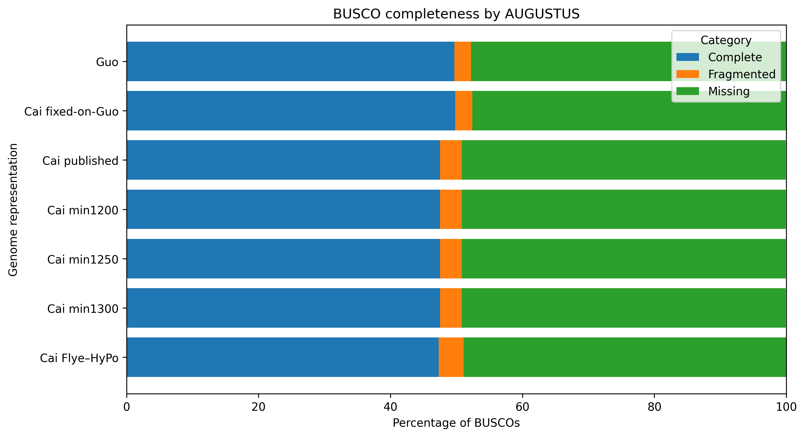

# RE-SAPRIA

## One species. Three genome representations. More than 1 Gb of disagreement.

**RE-SAPRIA** is a comparative-genomics project built around an unusually difficult biological and computational problem: two published genome projects for the endoparasitic plant *Sapria himalayana* produced dramatically different representations of the same species, and an independent reconstruction of one dataset produced a third.

[](https://doi.org/10.5281/zenodo.23072450)

## Before the numbers: meet *Sapria* — and meet Cai and Guo

If **Rafflesia** is the Rafflesiaceae member you already know, *Sapria* is one of its less famous relatives.

*Sapria himalayana* is **not a species of Rafflesia**, but both genera belong to the family **Rafflesiaceae**. These plants represent an extreme form of endoparasitism: most of the vegetative plant body is reduced and embedded within the tissues of a host vine, while the flower is the spectacular part that eventually emerges. In *Sapria*, the flower is roughly dinner-plate sized; in its more famous relative *Rafflesia*, flowers can become much larger [1,3,4].

### Meet the organism behind the numbers

Before this repository turns *Sapria* into gigabases, mapping percentages, and BUSCO scores, this is the organism itself.

| Female *S. himalayana* | Male *S. himalayana* |
|:---:|:---:|
|  |  |
| Female flower, Chiang Mai, Thailand | Male flower, Chiang Mai, Thailand |

The flowers are the conspicuous part of a plant whose vegetative existence is otherwise largely hidden within its host. That contrast—a spectacular flower emerging from an extraordinarily reduced parasitic body—is exactly why Rafflesiaceae have fascinated botanists for generations, and why their genomes pose such unusual evolutionary questions.

That bizarre biology made Rafflesiaceae a genomic frontier. How much of the ordinary flowering-plant genetic toolkit can disappear when a plant outsources so much of its life to a host? And what happens to the DNA that remains?

### The Cai journey — the first genomic window

In 2021, **Liming Cai and colleagues**, in a Harvard-led collaboration including **Charles C. Davis** and **Timothy B. Sackton** together with collaborators in Southeast Asia and elsewhere, published *Deeply Altered Genome Architecture in the Endoparasitic Flowering Plant Sapria himalayana* in *Current Biology* [1].

That study showed just how far a flowering-plant genome could be remodeled under extreme parasitism: extensive conserved-gene loss, extraordinary intron architecture, and substantial host-to-parasite horizontal gene transfer. In this repository, **“Cai”** is shorthand for the accession, sequencing data, and published genome representation originating from that study.

### The Guo journey — a second independent view

In 2023, **Xuelian Guo, Xiaodi Hu, and colleagues** from the Institute of Botany, Chinese Academy of Sciences, Novogene Bioinformatics Institute, Xishuangbanna Tropical Botanical Garden, and collaborating groups published another independent *S. himalayana* genome in *BMC Biology* [2].

That study approached the same extraordinary species with a different dataset and investigated its reduced body plan, flower development, metabolism, defense, gene loss, and horizontal gene transfer. In this repository, **“Guo”** is shorthand for the accession, sequencing data, and published genome representation originating from that study.

> **Cai and Guo, stated herein, are two independently studied accessions and two published genomic views of the same species, *Sapria himalayana*.**

RE-SAPRIA begins where those two journeys meet.

Two independent studies produced genomes that agree strongly in some places but differ spectacularly in others. Rather than immediately declaring one representation “right” and the other “wrong,” RE-SAPRIA asks what the disagreement itself can teach us.

### The 30-second paradox

| Genome representation analyzed in RE-SAPRIA | Assembly span | Interpretation |
|---|---:|---|
| **Guo published** | **2.061 Gb** | Published Guo structural representation |
| **Cai published** | **1.276 Gb** | Published Cai structural representation |
| **Cai Flye–HyPo** | **0.966 Gb** | Independent Cai long-read reconstruction |

The largest and smallest representations differ by approximately **1.09 Gb** and by more than **twofold** in assembled span.

Yet independent Cai reads still recognize most of the much larger Guo assembly:

| Cai evidence mapped to Guo | Result |
|---|---:|
| ONT primary mapping rate | **92.68%** |
| ONT reference breadth covered | **88.11%** |
| Illumina primary mapping rate | **97.87%** |
| Illumina reference breadth covered | **~92.93%** |

There is a second twist: **conserved gene recovery barely tracks the enormous difference in assembly span**.

Across representations spanning approximately **0.966–2.061 Gb**, complete BUSCO recovery remains in a relatively narrow range:

- **AUGUSTUS:** **47.3–49.8% complete**
- **Miniprot:** **49.2–51.4% complete**

The smallest independent reconstruction therefore does not show a proportional collapse of conserved gene space.

So the central question is **not** simply:

> Why are the Cai and Guo genomes different?

It is:

> **How much of the apparent difference is genuine biology, and how much is created by reconstructing and annotating an extraordinarily repeat-rich genome?**

That is the problem RE-SAPRIA is designed to resolve.

> **Important note on genome sizes:** the values above are direct SeqKit measurements of the FASTA representations analyzed in this repository. They should not automatically be equated with biological genome-size estimates, and publication-level headline values may differ because of assembly representation and reporting conventions.

---

# Why this matters

*Sapria himalayana* belongs to Rafflesiaceae, a lineage already known for extreme endoparasitism, major gene loss, plastome loss, and host–parasite horizontal gene transfer [1–4]. The Cai genome study also reported an unusual combination of widespread gene loss with exceptionally long introns in a subset of retained genes [1], while the later Guo genome provided an independently assembled view of the same species [2].

RE-SAPRIA asks what happens when such an extreme biological system is also an extreme **genome-reconstruction problem**.

### Importance

Genome assembly is usually treated as the substrate for downstream biology. In *Sapria*, that assumption becomes risky: different reconstructions of the same species differ so dramatically that assembly representation itself can change the biological story.

### Significance

If repeat-rich sequence penetrates deeply into genuine gene space, then assembly, repeat masking, and gene prediction are no longer separable technical steps. They become interacting parts of the same biological inference problem.

### Impact

RE-SAPRIA aims to provide a **read-backed, representation-aware framework** for deciding which conclusions remain stable across alternative reconstructions and annotation strategies. The immediate case is *S. himalayana*; the broader value is a testable workflow for future extreme parasitic-plant genomes, especially when repeats, structural complexity, and reduced gene complements make a single assembly or annotation potentially misleading.

This project is therefore **not an assembly contest**.

The aim is not to declare one genome representation universally “correct.” The aim is to determine:

> **Which biological conclusions survive changes in reconstruction, repeat treatment, and annotation strategy?**

---

# The Central Hypotheses

RE-SAPRIA is organized around three linked, testable hypotheses.

## 1. Biological divergence versus genome reconstruction

The striking differences between the Cai and Guo *S. himalayana* genome representations reflect a combination of **genuine biological divergence and reconstruction-dependent effects**, rather than biological variation alone.

Differences in assembly span, sequence recovery, structural organization, and apparent gene content must therefore be tested against independent read support and alternative genome representations before being interpreted biologically.

### Prediction

If much of the apparent Cai–Guo difference is reconstruction-associated, then Cai reads should still strongly support substantial portions of the Guo representation despite the large assembly-span discrepancy.

That prediction is already supported by the ONT and Illumina mapping results above.

---

## 2. Repeat architecture shapes genome annotation

The extremely repeat-rich architecture of *S. himalayana* makes gene prediction unusually sensitive to **repeat treatment and annotation strategy**.

Exposed repetitive sequence can generate inflated or fragmented predictions, whereas aggressive masking could also obscure genuine repeat-containing genes. Repeat-aware annotation therefore requires independent evidence rather than assuming either masked or unmasked predictions are intrinsically correct.

### Prediction

Holding the genome sequence and prediction model constant while changing repeat visibility should substantially alter the apparent gene space if repeats are driving prediction instability.

A controlled AUGUSTUS experiment does exactly that:

| Same Guo genome, same trained AUGUSTUS model | Predicted genes | CDS features |
|---|---:|---:|
| **Unmasked** | **106,782** | **434,794** |
| **Softmasked** | **30,906** | **153,165** |

The unmasked genome produces approximately **3.46×** as many predicted genes.

This is not yet proof that all additional models are false genes. The decisive next step is to determine where the extra predictions occur and how strongly they overlap repetitive sequence.

---

## 3. Giant introns represent repeat-expanded gene space

The unusually large introns found in *S. himalayana* are hypothesized to arise substantially through **repeat accumulation within otherwise genuine genes**, creating a form of expanded gene architecture that is especially vulnerable to assembly and annotation errors.

These giant introns may also preserve biologically informative material—including transposable-element relics, duplicated fragments, regulatory sequence, conserved noncoding sequence, or other evolutionary remnants—but such functions must be demonstrated rather than assumed.

### Standardized Phase 5 structural baseline

The standardized softmasked BRAKER3 panel now shows that long-intron architecture is robust across genome representations.

Using one representative transcript per gene, chosen by longest total CDS length:

| Representation | Representative introns | Median intron | Introns ≥10 kb | Intronic bp inside ≥10-kb introns | Maximum intron |
|---|---:|---:|---:|---:|---:|
| **Guo published** | **107,624** | **194 bp** | **9.13%** | **66.80%** | **115,994 bp** |
| **Cai fixed-on-Guo** | **116,488** | **159 bp** | **10.02%** | **70.57%** | **115,994 bp** |
| **Cai min1250** | **81,668** | **175 bp** | **11.18%** | **71.74%** | **129,246 bp** |
| **Cai Flye–HyPo** | **77,610** | **162 bp** | **11.44%** | **72.08%** | **105,468 bp** |

Only ~9–11% of representative introns are at least 10 kb long, yet they contain ~67–72% of all representative intronic sequence.

The earlier exploratory Guo working annotation (18,448 representative transcripts; 85,501 introns; maximum intron 160,996 bp) is retained as provenance but is no longer the standardized Phase 5 baseline.

The previously calculated repeat–intron correlation therefore needs to be recomputed against the standardized annotation once Phase 4 RepeatMasker GFFs are complete. Until then, the robust result is **long-intron structural dominance**, not a finalized repeat-overlap statistic.

---

# The emerging model

The working model is that the extraordinary apparent genomic divergence in *S. himalayana* emerges from an interaction among four layers:

**biological sequence divergence → repeat-rich genome architecture → reconstruction sensitivity → annotation sensitivity**

In other words, the problem is not merely that *Sapria* has a strange genome.

The problem is that its biology may make the genome unusually difficult to represent faithfully in the first place.

---

# Five genome representations, five different questions

The project deliberately keeps several genome representations rather than collapsing immediately onto a single “final genome.”

| Representation | What it is | What it tests |
|---|---|---|
| **Guo published** | Published Guo assembly, header-cleaned | Guo structural reference |
| **Cai published** | Published Cai assembly, header-cleaned | Historical Cai representation |
| **Cai min1250** | Published Cai with scaffolds <1,250 bp removed | Whether a minimal technical filter preserves biological signal |
| **Cai Flye–HyPo** | Independent Cai ONT reassembly polished with Illumina | Reconstruction effect |
| **Cai fixed-on-Guo** | Guo backbone carrying confident homozygous-alternate Cai alleles | Sequence-divergence control |

The **Cai fixed-on-Guo** genome is an analytical pseudogenome, **not** an independently assembled Cai genome.

A parallel Guo Flye reconstruction was attempted but did not yield a usable completed assembly. That failure is retained as provenance rather than interpreted biologically.

---

# What the data currently say

## 1. Much of Guo is independently recognized by Cai reads

Cai ONT and Illumina reads map extensively to the Guo assembly despite the very large assembly-span difference.

This means that the missing ~1 Gb cannot simply be labeled “biological sequence present in Guo but absent in Cai.”

Read support, repeat structure, mappability, reconstruction, and true accession differences must be separated.

---

## 2. Real Cai–Guo sequence differences remain abundant

The strict small-variant set currently contains:

| Variant class | Count |
|---|---:|
| Total high-confidence small variants | **4,535,955** |
| SNPs | **3,704,632** |
| Indels | **831,323** |
| Heterozygous-like calls | **3,377,317** |
| Homozygous-alternate calls | **1,158,638** |

Cai ONT reads additionally produced **54,117 PASS structural-discrepancy calls** relative to the Guo coordinate system.

These differences are real analytical signals, but they are deliberately described as **Cai–Guo differences or structural discrepancies**, not population-level variants. Two accessions are not a population sample.

---

## 3. A controlled Cai-on-Guo genome separates sequence from structure

The **Cai fixed-on-Guo** pseudogenome applies confident homozygous-alternate Cai alleles to the Guo structural backbone.

That creates an unusually useful control:

> **Change Cai-like sequence while holding Guo-like large-scale structure largely constant.**

The same three Guo RNA-seq libraries map almost identically to Guo and Cai-fixed:

| Genome | Mean HISAT2 overall alignment |
|---|---:|
| Guo | **96.92%** |
| Cai fixed-on-Guo | **96.79%** |
| Cai Flye–HyPo | **95.88%** |
| Cai published | **95.24%** |
| Cai min1250 | **95.15%** |

The small Guo → Cai-fixed change, compared with the larger shift toward independently reconstructed Cai genomes, suggests that **reconstruction-associated differences contribute more to transcriptomic mappability than fixed nucleotide substitutions alone**.

That interpretation will continue to be tested rather than assumed.

---

## 4. Minimal filtering rescues the published Cai assembly without materially changing transcript-space recovery

The published Cai assembly contains **128,027 FASTA records**, which creates practical problems for some downstream annotation workflows.

Removing scaffolds shorter than **1,250 bp** reduces the assembly to **99,251 records** while retaining:

- **1,244,196,188 bp**
- **97.49%** of the original assembled span
- essentially unchanged RNA-seq mappability (**95.24% → 95.15%** mean alignment)

This makes `Cai_min1250` a technical rescue representation, not a claim of improved biological assembly quality.

Its higher N50 after filtering is a mathematical consequence of removing short records and must not be interpreted as assembly improvement.

---

## 5. Conserved gene recovery stays unexpectedly stable across radically different genome spans

All harmonized BUSCO analyses used **BUSCO 5.8.0** with `embryophyta_odb10` (**n = 1,614**) [8], evaluated independently with AUGUSTUS and Miniprot [9].

| Representation | AUGUSTUS C / F / M | Miniprot C / F / M | Miniprot complete BUSCOs |
|---|---:|---:|---:|
| **Guo** | **49.7 / 2.5 / 47.8%** | **51.2 / 4.5 / 44.2%** | **827** |
| **Cai fixed-on-Guo** | **49.8 / 2.6 / 47.6%** | **51.4 / 4.3 / 44.3%** | **830** |
| **Cai published** | **47.5 / 3.3 / 49.1%** | **49.3 / 5.4 / 45.4%** | **795** |
| **Cai min1200** | **47.5 / 3.3 / 49.1%** | **49.2 / 5.4 / 45.4%** | **794** |
| **Cai min1250** | **47.5 / 3.3 / 49.1%** | **49.2 / 5.4 / 45.4%** | **794** |
| **Cai min1300** | **47.5 / 3.3 / 49.1%** | **49.2 / 5.4 / 45.4%** | **794** |
| **Cai Flye–HyPo** | **47.3 / 3.8 / 48.9%** | **50.5 / 4.9 / 44.6%** | **815** |




Three controls matter here.

First, **Guo and Cai fixed-on-Guo are nearly indistinguishable**: 802 versus 803 complete AUGUSTUS BUSCOs and 827 versus 830 complete Miniprot BUSCOs. Replacing confident fixed Cai alleles on the Guo backbone therefore barely changes conserved-gene recovery.

Second, **the 1,250-bp Cai filter is strongly validated**. Published Cai and all three filtered derivatives have identical AUGUSTUS BUSCO profiles; Miniprot changes from 795 complete BUSCOs in published Cai to 794 in the filtered assemblies. The technical filter therefore crosses the practical <100,000-record threshold while preserving essentially all BUSCO-detectable conserved gene space.

Third, **Cai Flye–HyPo is much smaller without showing proportional loss of conserved genes**. Miniprot recovers 815 complete BUSCOs from the ~0.966-Gb reconstruction versus 795 from the ~1.276-Gb published Cai assembly, while AUGUSTUS remains essentially stable (764 versus 767 complete BUSCOs).

BUSCO does **not** tell us that the missing ~50% is purely biological gene loss. Missing BUSCOs in this system can reflect true loss, extreme divergence, fragmentation, giant gene architecture, or predictor/alignment limitations. The point is different: enormous changes in recovered DNA span do not translate into equally enormous changes in recognizable conserved gene space.

Detailed outputs are available in [`03_phase3_harmonized_comparison/assembly_qc/busco/`](03_phase3_harmonized_comparison/assembly_qc/busco/).

---

## 6. Annotation itself becomes an experimental variable

RE-SAPRIA deliberately compares annotation strategies rather than treating gene prediction as a black box.

The current annotation branch includes:

- RNA-supported **BRAKER3** analyses [6];
- a controlled **AUGUSTUS masked-versus-unmasked** experiment;
- **Helixer** as an orthogonal pretrained land-plant predictor [7];
- repeat discovery and masking using species-specific RepeatModeler/RepeatMasker workflows [5].

In our current Helixer runs, the Guo unmasked and softmasked genomes produced **identical predictions** under the same land-plant model and settings. In contrast, AUGUSTUS changed dramatically when repeat visibility changed.

That disagreement is useful.

It means the predictors are responding differently to the same extreme genome, which turns annotation strategy into something that can be experimentally interrogated rather than merely chosen.

---

## 7. Standardized BRAKER annotations separate annotation scale from assembly span

The four softmasked BRAKER3 runs produce:

| Representation | Genes | Transcripts | Gene density |
|---|---:|---:|---:|
| **Guo published** | **29,792** | **34,471** | **14.46/Mb** |
| **Cai fixed-on-Guo** | **29,887** | **34,783** | **14.50/Mb** |
| **Cai min1250** | **20,149** | **24,733** | **16.19/Mb** |
| **Cai Flye–HyPo** | **19,430** | **23,822** | **20.10/Mb** |

Guo and Cai fixed-on-Guo remain nearly identical at global annotation scale. The two Cai structural representations also converge closely in gene and transcript number despite a 22.3% difference in assembly span.

Cai Flye–HyPo additionally produces a higher structural-completeness proxy: **97.30%** of transcripts contain both explicit start- and stop-codon features, compared with **88.00%** in Cai min1250.

These results reinforce the central RE-SAPRIA pattern: **annotation space does not scale linearly with assembly span**.

Detailed Phase 5 analyses are archived in [`05_phase5_gene_annotation/`](05_phase5_gene_annotation/).


---

# Why *Sapria* is an unusually powerful system

Rafflesiaceae already sit near an extreme of flowering-plant biological dependency.

Members of the family are endoparasites that spend most of their life embedded within their hosts. Their evolutionary history includes extensive reduction of canonical plant functions, organellar-genome loss in *Rafflesia*, and host-associated horizontal gene transfer [1,3,4].

*Sapria* adds another layer:

> **A genome can be biologically reduced while remaining structurally enormous and repeat-rich.**

That combination is especially informative because it separates two ideas that are often conflated:

- **fewer biological functions**, and
- **less DNA**.

They are not the same thing.

In *Sapria*, extensive gene loss can coexist with repeat expansion and giant introns [1,2].

RE-SAPRIA therefore uses this system to ask a broader evolutionary question:

> **When biological autonomy is reduced, what happens to the genomic architecture that remains?**

---

# The project logic

```text
Two published genomes disagree dramatically
                    │
                    ▼
       Are they biologically different?
                    │
        ┌───────────┴───────────┐
        ▼                       ▼
Independent Cai reads     Independent Cai assembly
mapped to Guo             (Flye–HyPo)
        │                       │
        └───────────┬───────────┘
                    ▼
      Separate sequence divergence
        from reconstruction effects
                    │
                    ▼
        Map repeat architecture
                    │
                    ▼
     Test annotation sensitivity
                    │
                    ▼
   Identify robust vs unstable genes
                    │
                    ▼
 Ask what survives across representations
```

The stop rule is simple:

> **A result belongs in the central story only if it helps establish assembly concordance, explains assembly discordance, or demonstrates a biological/annotation consequence.**

Everything else goes to supplementary material, provenance, or future work.

---

# Enter the repository here

If this is your first visit, these are the most useful entry points:

| If you want to understand... | Start here |
|---|---|
| Why the two published genomes looked so different | [`00_phase0_published_baseline/`](00_phase0_published_baseline/) |
| How the Cai independent reassembly was generated | [`01_phase1_cai_reassembly/`](01_phase1_cai_reassembly/) |
| Whether Cai reads support Guo and how Cai-fixed was constructed | [`02_phase2_cai_mapping_to_guo/`](02_phase2_cai_mapping_to_guo/) |
| Harmonized genome-to-genome comparisons | [`03_phase3_harmonized_comparison/`](03_phase3_harmonized_comparison/) |
| Repeat discovery and masking | [`04_phase4_repeat_annotation/`](04_phase4_repeat_annotation/) |
| BRAKER, AUGUSTUS, Helixer, and annotation comparisons | [`05_phase5_gene_annotation/`](05_phase5_gene_annotation/) |
| Giant introns and functional/comparative genomics | [`06_phase6_functional_comparative_genomics/`](06_phase6_functional_comparative_genomics/) |
| Manuscript-ready figures, tables, and supplements | [`07_phase7_manuscript_outputs/`](07_phase7_manuscript_outputs/) |
| Exploratory internship analyses | [`90_andrian_exploratory/`](90_andrian_exploratory/) |
| Student and public introductions to the project | [`99_education/`](99_education/) |

---

# Project status

| Phase | Scope | Status |
|---|---|---|
| **Phase 0** | Published Cai–Guo baseline comparison | **Complete** |
| **Phase 1** | Cai independent reassembly and polishing | **Complete** |
| **Phase 2** | Cai mapping to Guo, variants, Cai-fixed pseudogenome | **Complete** |
| **Phase 3** | Harmonized genome comparison | **Complete** |
| **Phase 4** | Repeat discovery and annotation | **Active / completing** |
| **Phase 5** | Structural gene annotation and annotation-method comparison | **Active / major runs complete** |
| **Phase 6** | Functional and comparative genomics | **Beginning** |
| **Phase 7** | Manuscript figures, tables, methods, supplements | **Planned** |
| **Track 90** | Andrian exploratory internship analyses | **Active / archival** |

---

# Reproducibility philosophy

RE-SAPRIA is an **analysis notebook, provenance record, and manuscript-development workspace**, not a polished software package.

The repository preserves the material needed to understand how each conclusion was reached:

- analysis decisions;
- software versions;
- Galaxy workflows and command histories;
- compact QC outputs;
- summary statistics;
- scripts;
- figures;
- failed major analytical branches;
- interpretation notes;
- manuscript-ready outputs.

Large primary and intermediate files—including raw FASTQ, large BAM files, full genome FASTA files, and very large repeat catalogues—are kept outside ordinary Git history and are intended for archival deposition such as Zenodo.

Failed analyses are not silently erased. If a major branch was attempted and did not produce a usable result, that failure is documented so that the analytical history remains interpretable.

The standardized Phase 5A BRAKER3 and AUGUSTUS GFF3 annotations are permanently archived on Zenodo (DOI: 10.5281/zenodo.23072450).

---

# Interpretation limits

RE-SAPRIA deliberately separates observation from inference.

The Cai and Guo datasets represent **two accessions**, not populations. Therefore:

- Cai–Guo differences cannot be generalized as species-wide polymorphism;
- Thailand-versus-China regional adaptation cannot be inferred from these two accessions;
- structural discrepancies are not automatically biological structural variants;
- regions without Cai read support are not automatically Guo-specific DNA;
- assembly-span differences are not automatically biological genome-size differences;
- additional gene predictions in unmasked sequence are not automatically genuine genes;
- masked predictions are not automatically more correct;
- giant introns are strongly repeat-associated, but repeat content alone does not establish function.

The strongest claims in RE-SAPRIA are those that remain supported across **independent evidence types and alternative genome representations**.

---

# What would count as success?

RE-SAPRIA succeeds if it can move the discussion from:

> “The two *Sapria* genomes are very different.”

to:

> **“Here is which part of the difference is read-supported biology, which part depends on reconstruction, which part depends on repeats and annotation, and which conclusions remain stable regardless of representation.”**

That distinction matters more than choosing a single winning assembly.

---

# Project team

- **Dr. Adhityo Wicaksono (Aether Biomics, Indonesia)** — Project lead, conceptualization, main analysis, interpretation, and manuscript development
- **Prof. Dr. rer. nat. Arli Aditya Parikesit (Indonesia International Institute for Life-Sciences, i3L)** — Co-supervisor
- **Andrian Dary Fawwaz (Indonesia International Institute for Life-Sciences, i3L)** — Student research intern
- **H.E.L.I.O.S. (OpenAI ChatGPT)** — AI-assisted workflow design, analysis support, interpretation, and documentation

---

# Primary literature and methodological references

1. **Cai L, Arnold BJ, Xi Z, et al. (2021).** Deeply altered genome architecture in the endoparasitic flowering plant *Sapria himalayana* Griff. (Rafflesiaceae). *Current Biology* 31:1002–1011.e9.  
   DOI: https://doi.org/10.1016/j.cub.2020.12.045

2. **Guo X, Hu X, Li J, et al. (2023).** The *Sapria himalayana* genome provides new insights into the lifestyle of endoparasitic plants. *BMC Biology* 21:134.  
   DOI: https://doi.org/10.1186/s12915-023-01620-3

3. **Molina J, Hazzouri KM, Nickrent D, et al. (2014).** Possible loss of the chloroplast genome in the parasitic flowering plant *Rafflesia lagascae* (Rafflesiaceae). *Molecular Biology and Evolution* 31:793–803.  
   DOI: https://doi.org/10.1093/molbev/msu051

4. **Davis CC, Wurdack KJ. (2004).** Host-to-parasite gene transfer in flowering plants: phylogenetic evidence from Malpighiales. *Science* 305:676–678.  
   DOI: https://doi.org/10.1126/science.1100671

5. **Flynn JM, Hubley R, Goubert C, et al. (2020).** RepeatModeler2 for automated genomic discovery of transposable element families. *Proceedings of the National Academy of Sciences USA* 117:9451–9457.  
   DOI: https://doi.org/10.1073/pnas.1921046117

6. **Gabriel L, Brůna T, Hoff KJ, et al. (2024).** BRAKER3: fully automated genome annotation using RNA-seq and protein evidence with GeneMark-ETP, AUGUSTUS, and TSEBRA. *Genome Research*.  
   DOI: https://doi.org/10.1101/gr.278090.123

7. **Holst F, Bolger AM, Kindel F, et al. (2026).** Helixer: ab initio prediction of primary eukaryotic gene models combining deep learning and a hidden Markov model. *Nature Methods* 23:732–739.  
   DOI: https://doi.org/10.1038/s41592-025-02939-1

8. **Manni M, Berkeley MR, Seppey M, Simão FA, Zdobnov EM. (2021).** BUSCO Update: Novel and Streamlined Workflows along with Broader and Deeper Phylogenetic Coverage for Scoring of Eukaryotic, Prokaryotic, and Viral Genomes. *Molecular Biology and Evolution* 38:4647–4654.  
   DOI: https://doi.org/10.1093/molbev/msab199

9. **Li H. (2023).** Protein-to-genome alignment with miniprot. *Bioinformatics* 39:btad014.  
   DOI: https://doi.org/10.1093/bioinformatics/btad014

---

# Citation status

This repository is an active research record and should not yet be cited as a finalized genome resource.

Stable archival datasets and formal citation information will be added as the project reaches manuscript-ready status.

---

# License

This repository is licensed under the **MIT License**.

---

# Maintainer

**Adhityo Wicaksono**

---

# Final note

Rafflesiaceae are already famous for making a flowering plant look almost biologically impossible.

RE-SAPRIA asks whether their genomes may be just as difficult to define.

**One species. Multiple plausible genome representations. The biology is hidden in the disagreement.**
