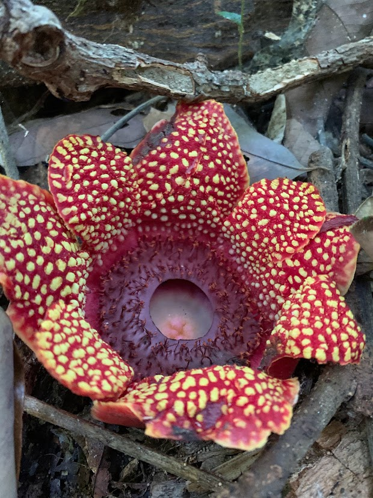
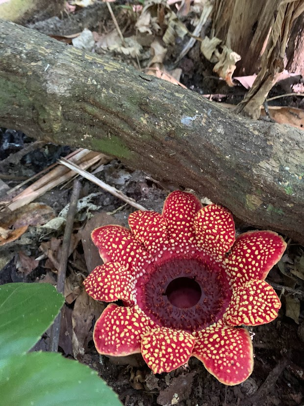

# RE-SAPRIA

## One species. Multiple genome representations. More than 1 Gb of disagreement.

**RE-SAPRIA** is a comparative-genomics project asking why independently generated genome representations of the endoparasitic plant *Sapria himalayana* differ so dramatically, and which biological conclusions remain stable when reconstruction, repeat treatment, and annotation strategy change.

 

> **Central question:** How much of the apparent Cai–Guo genomic difference is genuine biological divergence, and how much is reconstruction- and annotation-dependent behavior in an extraordinarily repeat-rich genome?

---

## Meet *Sapria*

*Sapria himalayana* is a member of **Rafflesiaceae**, the same family as *Rafflesia*, but it is a different genus. Most of the vegetative parasite remains embedded inside its host vine; the flower is the conspicuous part that emerges.

| Female *S. himalayana* | Male *S. himalayana* |
|:---:|:---:|
|  |  |
| Chiang Mai, Thailand | Chiang Mai, Thailand |

Two independent genome studies anchor this project:

- **Cai** = the 2021 *Current Biology* study by Liming Cai and colleagues.
- **Guo** = the 2023 *BMC Biology* study by Xuelian Guo, Xiaodi Hu, and colleagues.

In this repository, “Cai” and “Guo” are shorthand for **two independently studied accessions and their associated genome datasets/representations**, not species names.

---

## The paradox in 30 seconds

| Genome representation | Assembly span | Role |
|---|---:|---|
| **Guo published** | **2.061 Gb** | Published Guo structural reference |
| **Cai published** | **1.276 Gb** | Published Cai representation |
| **Cai Flye–HyPo** | **0.966 Gb** | Independent Cai long-read reconstruction |
| **Cai min1250** | **1.244 Gb** | Technical rescue of published Cai |
| **Cai fixed-on-Guo** | **2.061 Gb** | Guo backbone carrying confident fixed Cai alleles |

The largest and smallest representations differ by about **1.09 Gb**, yet:

- Cai ONT reads map to Guo at **92.68%** primary mapping with **88.11%** reference breadth.
- Cai Illumina reads map to Guo at **97.87%** primary mapping with **~92.93%** breadth.
- Complete BUSCO recovery changes only modestly across representations spanning ~0.97–2.06 Gb.

So assembly span alone does not explain recognizable conserved gene space.

---

# The three central hypotheses

RE-SAPRIA evaluates three linked ideas:

1. **Biological divergence versus reconstruction**  
   Cai–Guo differences reflect an interaction between genuine biological
   divergence and reconstruction-dependent effects.

2. **Repeat architecture shapes annotation**  
   Extreme repeat abundance makes gene prediction sensitive to representation,
   repeat treatment, and annotation strategy.

3. **Repeat-expanded gene space**  
   Giant introns represent a reproducible interface between repetitive sequence
   and gene architecture.

The Phase 7 manuscript-preparation directory records the analytical endpoint.
Detailed integrated interpretation is reserved for the manuscript and eventual
preprint/publication.

---

# Working model

The current evidence supports a linked model:

**repeat-rich genome architecture → reconstruction sensitivity → repeat-expanded introns → annotation sensitivity**

Biological Cai–Guo sequence divergence is real, but the observed genome difference cannot be interpreted as biological divergence alone.

---

# Genome representations and what they test

| Representation | Purpose |
|---|---|
| **Guo published** | Structural reference |
| **Cai published** | Historical published Cai representation |
| **Cai min1250** | Tests whether minimal scaffold filtering preserves biological signal |
| **Cai Flye–HyPo** | Tests reconstruction effects using an independent Cai assembly |
| **Cai fixed-on-Guo** | Tests fixed sequence divergence while largely holding Guo structure constant |

**Cai fixed-on-Guo is an analytical pseudogenome, not an independent Cai assembly.**

A Guo Flye reconstruction was attempted but did not yield a usable completed assembly; that failure is retained as technical provenance and is not interpreted biologically.

---

# Repository map

| Question | Directory |
|---|---|
| What did the published Cai and Guo assemblies originally look like? | [`00_phase0_published_baseline/`](00_phase0_published_baseline/) |
| How was the independent Cai reconstruction made? | [`01_phase1_cai_reassembly/`](01_phase1_cai_reassembly/) |
| Do Cai reads support Guo, and how was Cai-fixed constructed? | [`02_phase2_cai_mapping_to_guo/`](02_phase2_cai_mapping_to_guo/) |
| How do the genome representations compare under harmonized QC? | [`03_phase3_harmonized_comparison/`](03_phase3_harmonized_comparison/) |
| Where are the repeats, and how much sequence do they explain? | [`04_phase4_repeat_annotation/`](04_phase4_repeat_annotation/) |
| How do repeats affect gene architecture and prediction? | [`05_phase5_gene_annotation/`](05_phase5_gene_annotation/) |
| Which robust genes and functions survive across representations? | [`06_phase6_functional_comparative_genomics/`](06_phase6_functional_comparative_genomics/) |
| Manuscript preparation and frozen analytical synthesis | [`07_phase7_manuscript_outputs/`](07_phase7_manuscript_outputs/) |
| Andrian's exploratory internship analyses | [`90_andrian_exploratory/`](90_andrian_exploratory/) |
| Student/public introductions | [`99_education/`](99_education/) |

---

# Project status

| Phase | Scope | Status |
|---|---|---|
| **0** | Published Cai–Guo baseline | **Complete** |
| **1** | Cai independent reassembly | **Complete** |
| **2** | Cai mapping to Guo and sequence comparison | **Complete** |
| **3** | Harmonized genome comparison | **Complete** |
| **4** | Repeat discovery and annotation | **Complete** |
| **5** | Structural and repeat-aware gene annotation | **Complete** |
| **6** | Functional and comparative genomics | **Complete** |
| **7** | Manuscript preparation | **Active** |
| **90** | Internship exploratory track | **Active / archival** |

**Phases 0–6 are analytically frozen.**

Phase 7 is now the active project phase.

---

# Interpretation guardrails

RE-SAPRIA deliberately separates observation from inference.

- Two accessions are not a population sample.
- Assembly span is not automatically biological genome size.
- Cai–Guo structural discrepancies are not automatically biological structural
  variants.
- Lack of read support is not automatically accession-specific DNA.
- Repeat-class proportions can be method-sensitive.
- Additional gene predictions are not automatically genuine genes or
  automatically artifacts.
- Repeat-rich giant introns do not establish regulatory function by themselves.
- Lack of detectable protein homology does not establish a novel gene.
- Cross-representation robustness should precede strong biological claims.

---

# Data availability

Large standardized datasets are archived separately from ordinary Git history.

## Phase 4 — repeat annotation

**Zenodo DOI:**  
https://doi.org/10.5281/zenodo.23105473

## Phase 5A — standardized BRAKER3 and AUGUSTUS annotations

**Zenodo DOI:**  
https://doi.org/10.5281/zenodo.23072450

GitHub stores compact source tables, scripts, figures, analytical decisions,
and documentation suitable for reproducibility.

Additional manuscript-associated datasets may be archived alongside the
preprint or publication.

---

# Project team

## Contributors

- **Dr. Adhityo Wicaksono** — project lead; conceptualization, analysis, interpretation, manuscript development
- **Prof. Dr. rer. nat. Arli Aditya Parikesit** — co-supervisor
- **Andrian Dary Fawwaz** — student research intern

## AI assistant

- **H.E.L.I.O.S. / OpenAI ChatGPT** — AI-assisted workflow design, analysis support, interpretation, and documentation

---

# Key references

1. Cai L, Arnold BJ, Xi Z, et al. (2021). *Deeply altered genome architecture in the endoparasitic flowering plant Sapria himalayana*. **Current Biology** 31:1002–1011.e9. https://doi.org/10.1016/j.cub.2020.12.045
2. Guo X, Hu X, Li J, et al. (2023). *The Sapria himalayana genome provides new insights into the lifestyle of endoparasitic plants*. **BMC Biology** 21:134. https://doi.org/10.1186/s12915-023-01620-3
3. Flynn JM, Hubley R, Goubert C, et al. (2020). RepeatModeler2. **PNAS** 117:9451–9457. https://doi.org/10.1073/pnas.1921046117
4. Gabriel L, Brůna T, Hoff KJ, et al. (2024). BRAKER3. **Genome Research**. https://doi.org/10.1101/gr.278090.123
5. Manni M, Berkeley MR, Seppey M, Simão FA, Zdobnov EM. (2021). BUSCO Update. **Molecular Biology and Evolution** 38:4647–4654. https://doi.org/10.1093/molbev/msab199
6. Li H. (2023). Protein-to-genome alignment with miniprot. **Bioinformatics** 39:btad014. https://doi.org/10.1093/bioinformatics/btad014

---

# License

MIT License.
